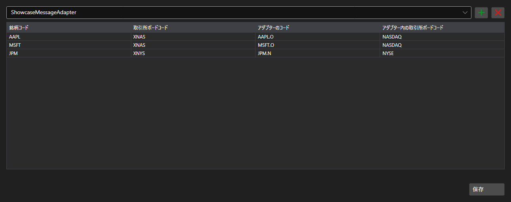

# 銘柄コードの対応付け



[SecurityMappingPanel](xref:StockSharp.Xaml.SecurityMappingPanel) - システム内の銘柄コードと、特定のコネクタでのコードとの対応表です。同じ限月の商品がデータ提供者ごとに違う名前で呼ばれる、という定番の問題を解決します。

**主なプロパティ**

- [SecurityMappingPanel.ConnectorsInfo](xref:StockSharp.Xaml.SecurityMappingPanel.ConnectorsInfo) - 対応付けを設定するコネクタの一覧。
- [SecurityMappingPanel.Storage](xref:StockSharp.Xaml.SecurityMappingPanel.Storage) - 対応付けの保存先。
- [SecurityMappingPanel.SaveText](xref:StockSharp.Xaml.SecurityMappingPanel.SaveText) - 保存ボタンの表示文字列。

行はテーブル上で直接追加・削除でき、保存ボタンを押すと `Saving` イベントが発生します。アプリケーションは変更を保存先へ書き込み、ボタンの文字列を変更します。

以下は使用例のコード断片です:

```xaml
<Window x:Class="Sample.MappingWindow"
	xmlns="http://schemas.microsoft.com/winfx/2006/xaml/presentation"
	xmlns:x="http://schemas.microsoft.com/winfx/2006/xaml"
	xmlns:xaml="http://schemas.stocksharp.com/xaml"
	Height="500" Width="900">
	<xaml:SecurityMappingPanel x:Name="MappingPanel" />
</Window>
```

```cs
// 対応付けの保存先を設定します
MappingPanel.Storage = _securityMappingStorage;

// コネクタを一覧に追加します
MappingPanel.ConnectorsInfo.Add(new ConnectorInfo("Binance"));

// ボタンの文字列で保存完了を示します
MappingPanel.Saving += () => MappingPanel.SaveText = LocalizedStrings.Saved;
```

## 関連項目

[サービスパネル](../service_panels.md)
