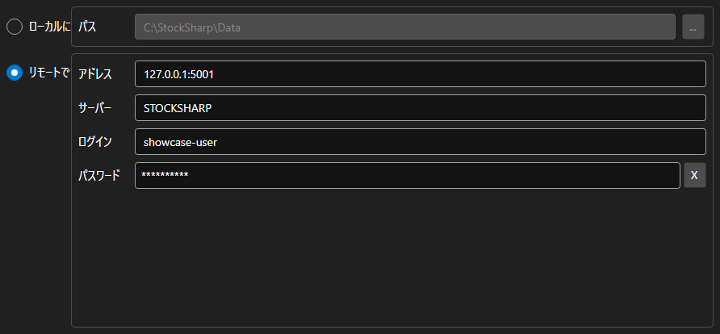

# ストレージ設定



[StorageSettingsPanel](xref:StockSharp.Xaml.StorageSettingsPanel) - マーケットデータの保存先を選ぶパネルです。ローカルフォルダーとリモートサーバーを切り替え、選んだ方のパラメータを設定します。

**主なプロパティ**

- [StorageSettingsPanel.IsLocal](xref:StockSharp.Xaml.StorageSettingsPanel.IsLocal) - ローカルストレージを使うかどうか。
- [StorageSettingsPanel.Path](xref:StockSharp.Xaml.StorageSettingsPanel.Path) - ローカルストレージのフォルダーパス。
- [StorageSettingsPanel.Address](xref:StockSharp.Xaml.StorageSettingsPanel.Address) - リモートサーバーのアドレス。
- [StorageSettingsPanel.Login](xref:StockSharp.Xaml.StorageSettingsPanel.Login) - リモートサーバーのユーザー名。
- [StorageSettingsPanel.IsCredentialsEnabled](xref:StockSharp.Xaml.StorageSettingsPanel.IsCredentialsEnabled) - ログインとパスワードの入力欄を使えるかどうか。

変更があるたびに `SettingsChanged` イベントが発生し、アプリケーションはそれを受けて [IMarketDataDrive](xref:StockSharp.Algo.Storages.IMarketDataDrive) を作り直します。

以下は使用例のコード断片です:

```xaml
<Window x:Class="Sample.StorageWindow"
	xmlns="http://schemas.microsoft.com/winfx/2006/xaml/presentation"
	xmlns:x="http://schemas.microsoft.com/winfx/2006/xaml"
	xmlns:xaml="http://schemas.stocksharp.com/xaml"
	Height="300" Width="500">
	<xaml:StorageSettingsPanel x:Name="StoragePanel" />
</Window>
```

```cs
// ローカルフォルダーを選びます
StoragePanel.IsLocal = true;
StoragePanel.Path = @"C:\Data";

// 設定が変更されたことを記録します
StoragePanel.SettingsChanged += () => _isModified = true;

// パネルの設定からストレージを作成します
var drive = StoragePanel.IsLocal
	? new LocalMarketDataDrive(StoragePanel.Path)
	: (IMarketDataDrive)new RemoteMarketDataDrive(StoragePanel.Address.To<EndPoint>());
```

## 関連項目

[サービスパネル](../service_panels.md)
