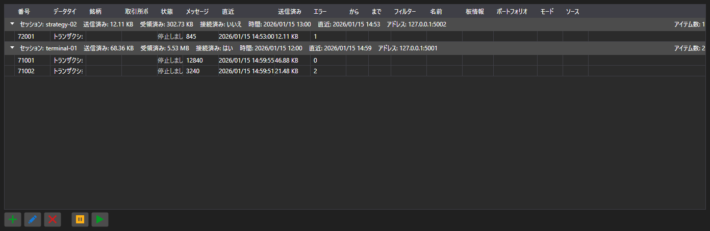

# サブスクリプション



[SubscriptionPanel](xref:StockSharp.Xaml.SubscriptionPanel) - セッション単位でグループ化された、有効なサブスクリプションのテーブルです。各サブスクリプションについてデータ種別、メッセージ数、最終メッセージ時刻、エラー数、転送量を表示します。

**主なプロパティ**

- [SubscriptionPanel.Subscriptions](xref:StockSharp.Xaml.SubscriptionPanel.Subscriptions) - サブスクリプションの一覧。
- [SubscriptionPanel.Sessions](xref:StockSharp.Xaml.SubscriptionPanel.Sessions) - セッションの一覧。
- [SubscriptionPanel.SelectedSubscriptions](xref:StockSharp.Xaml.SubscriptionPanel.SelectedSubscriptions) - 選択されたサブスクリプション。

このパネルはサーバー側で使います。誰が接続し、何を要求し、どれだけデータを受け取っているかが分かります。行に対する追加・変更・削除・一時停止の操作は同名のイベントを発生させ、実際の処理はアプリケーションが行います。

以下は使用例のコード断片です:

```xaml
<Window x:Class="Sample.SubscriptionsWindow"
	xmlns="http://schemas.microsoft.com/winfx/2006/xaml/presentation"
	xmlns:x="http://schemas.microsoft.com/winfx/2006/xaml"
	xmlns:xaml="http://schemas.stocksharp.com/xaml"
	Height="400" Width="1000">
	<xaml:SubscriptionPanel x:Name="SubscriptionPanel" />
</Window>
```

```cs
// クライアントのセッションを登録します
SubscriptionPanel.AddSession(sessionId, new SessionInfo(sessionId, DateTime.UtcNow, address));

// サブスクリプションをテーブルに追加します
SubscriptionPanel.Subscriptions.Add(new SubscriptionInfo(session, subscription));

// テーブルからの指示で購読を解除します
SubscriptionPanel.SubscriptionRemoving += info => _connector.UnSubscribe(info.Subscription);
```

## 関連項目

[サービスパネル](../service_panels.md)
