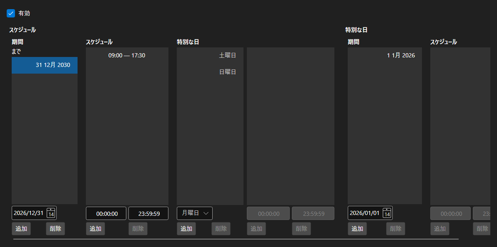

# 営業スケジュール



[WorkingTimeControl](xref:StockSharp.Xaml.WorkingTimeControl) - [WorkingTime](xref:StockSharp.Messages.WorkingTime) スケジュールのエディタです。スケジュールの有効期間、曜日ごとの営業時間、休日や振替といった特別日を設定します。

**主なプロパティ**

- [WorkingTimeControl.WorkingTime](xref:StockSharp.Xaml.WorkingTimeControl.WorkingTime) - 編集中のスケジュール。
- [WorkingTimeControl.ShowActive](xref:StockSharp.Xaml.WorkingTimeControl.ShowActive) - 現在有効な期間の表示。

スケジュールは期間の集まりで、期間ごとに曜日別の営業時間を持ちます。時間は区間の一覧として編集し、区間の重なりや終了が開始より前といった誤りは `Error` イベントで通知されます。

以下は使用例のコード断片です:

```xaml
<Window x:Class="Sample.WorkingTimeWindow"
	xmlns="http://schemas.microsoft.com/winfx/2006/xaml/presentation"
	xmlns:x="http://schemas.microsoft.com/winfx/2006/xaml"
	xmlns:xaml="http://schemas.stocksharp.com/xaml"
	Height="500" Width="700">
	<xaml:WorkingTimeControl x:Name="WorkingTimeControl" />
</Window>
```

```cs
// 市場のスケジュールを表示します
WorkingTimeControl.WorkingTime = ExchangeBoard.MicexTqbr.WorkingTime;

// エラーをエディタの横に表示します
WorkingTimeControl.Error += (message, isError) => ShowStatus(message, isError);

// スケジュールの変更を記録します
WorkingTimeControl.DataChanged += () => _isModified = true;
```

## 関連項目

[サービスパネル](../service_panels.md)
