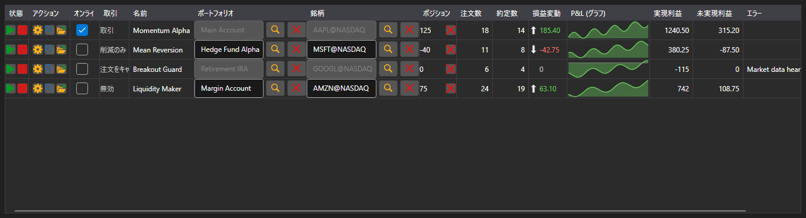

# 戦略モニター



[StrategiesDashboard](xref:StockSharp.Xaml.StrategiesDashboard) - 同時に稼働している戦略の一覧表です。1 行で銘柄、ポートフォリオ、状態、ポジション、損益、注文数・約定数、操作ボタンを表示します。

**主なプロパティ**

- [StrategiesDashboard.Items](xref:StockSharp.Xaml.StrategiesDashboard.Items) - モニターの行の一覧。
- [StrategiesDashboard.SecurityProvider](xref:StockSharp.Xaml.StrategiesDashboard.SecurityProvider) - 銘柄列のための銘柄プロバイダ。
- [StrategiesDashboard.Portfolios](xref:StockSharp.Xaml.StrategiesDashboard.Portfolios) - ポートフォリオ列のためのポートフォリオソース。

モニターの行は戦略そのものではなく [IStrategiesDashboardItem](xref:StockSharp.Xaml.IStrategiesDashboardItem) です。開始・停止・建玉の決済・設定・リスクルールの各ボタンはこのインターフェイスのコマンドで動作します。そのためローカルの戦略にもサーバー上の戦略にも同じように使えます。

以下は使用例のコード断片です:

```xaml
<Window x:Class="Sample.DashboardWindow"
	xmlns="http://schemas.microsoft.com/winfx/2006/xaml/presentation"
	xmlns:x="http://schemas.microsoft.com/winfx/2006/xaml"
	xmlns:xaml="http://schemas.stocksharp.com/xaml"
	Height="400" Width="1100">
	<xaml:StrategiesDashboard x:Name="Dashboard" />
</Window>
```

```cs
// 銘柄列とポートフォリオ列のソースを設定します
Dashboard.SecurityProvider = _connector;
Dashboard.Portfolios = new PortfolioDataSource(_connector);

// 自分の戦略の行をモニターに追加します
foreach (var strategy in _strategies)
	Dashboard.Items.Add(new StrategyDashboardItem(strategy));

// 停止した戦略をモニターから外します
Dashboard.Items.Remove(Dashboard.Items.First(i => i.ProcessState == ProcessStates.Stopped));
```

## 関連項目

[ストラテジー](../strategies.md)
