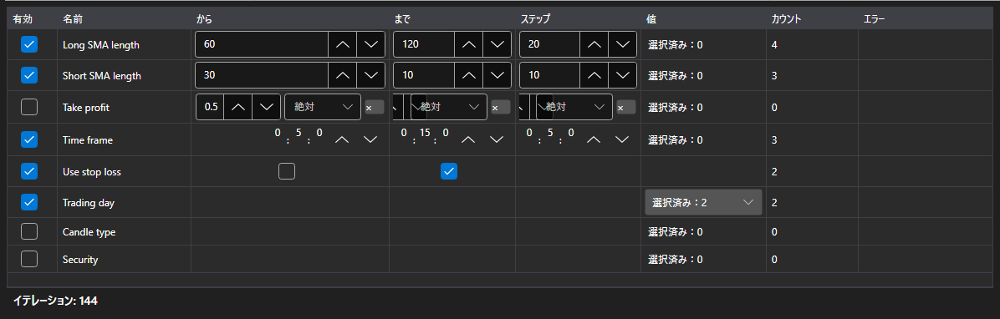

# 最適化パラメーター



[OptimizationParametersPanel](xref:StockSharp.Xaml.OptimizationParametersPanel) \- 探索の対象となるパラメーターのエディタです。1 行が戦略の 1 つのパラメーターにあたり、チェックボックスでそれを探索に含めるかどうかを決め、その先に上下限と刻み、または値の一覧が並びます。テーブルの下には集計として、現在の設定が何回の実行になるかが表示されます。

**主なプロパティ**

- [OptimizationParametersPanel.Parameters](xref:StockSharp.Xaml.OptimizationParametersPanel.Parameters) \- エディタの行。[IOptimizationParameterRow](xref:StockSharp.Xaml.IOptimizationParameterRow) のコレクションであれば何でも使えるため、アプリケーションごとに独自のパラメーターモデルを持てます。
- [OptimizationParametersPanel.MaxIterations](xref:StockSharp.Xaml.OptimizationParametersPanel.MaxIterations) \- 実行回数の上限。ゼロは上限なしを意味します。
- [OptimizationParametersPanel.TotalCount](xref:StockSharp.Xaml.OptimizationParametersPanel.TotalCount) \- 現在の設定が何回の実行になるか。探索に含めたすべてのパラメーターの値の個数の積を、上限で切り詰めた数です。
- [OptimizationParametersPanel.FirstProblem](xref:StockSharp.Xaml.OptimizationParametersPanel.FirstProblem) \- 現在の設定を実行できない最初の理由。

値の集合はパラメーターの型によって決まります。数値と [TimeSpan](xref:System.TimeSpan) では上下限と刻み、[bool](xref:System.Boolean) では 2 つの値、列挙型と [Security](xref:StockSharp.BusinessEntities.Security)、[DataType](xref:StockSharp.Messages.DataType) では明示的な一覧です。探索を通せない行 (刻みがゼロ、上下限が未設定、一覧が空) は、その理由をテーブルの中に直接示し、集計はその行を数えません。

実行回数は和ではなく積で増えます。5 つの値を持つパラメーターが 3 つあれば 15 回ではなく 125 回です。そのため集計はウィザードの次の手順ではなく、テーブルのすぐ隣に置かれています。

以下は使用例のコード断片です:

```xaml
<Window x:Class="Sample.OptimizationWindow"
	xmlns="http://schemas.microsoft.com/winfx/2006/xaml/presentation"
	xmlns:x="http://schemas.microsoft.com/winfx/2006/xaml"
	xmlns:xaml="http://schemas.stocksharp.com/xaml"
	Height="400" Width="700">
	<xaml:OptimizationParametersPanel x:Name="ParametersPanel" />
</Window>
```

```cs
// エディタの行は IOptimizationParameterRow を実装したアプリケーション側のモデルです
ParametersPanel.Parameters = _rows;

// 実行回数の上限
ParametersPanel.MaxIterations = 5000;

// 設定が空でなく、そこにエラーもないときに実行できます
StartButton.IsEnabled = ParametersPanel.TotalCount > 0 && ParametersPanel.FirstProblem.Length == 0;
```

## 関連項目

[ストラテジー](../strategies.md)

[最適化結果](optimization_results.md)
