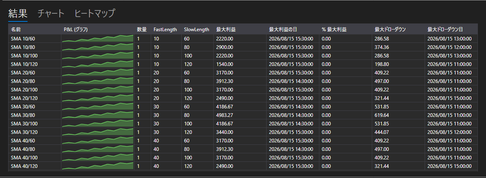

# 最適化結果



[OptimizationResultsPanel](xref:StockSharp.Xaml.Charting.OptimizationResultsPanel) \- 探索の結果を読み解く 3 つの方法を 1 つのコントロールにまとめたものです:

- **結果** \- 実行の一覧表です。パラメーターの値、統計、そして各実行の損益チャートが、その数値の隣に並びます。これは [StrategiesStatisticsPanel](xref:StockSharp.Xaml.StrategiesStatisticsPanel) なので、列の並べ替えも設定も他と同じようにできます。
- **チャート** \- 2 つのパラメーターによる三次元のサーフェスです。軸はチャートの上にある一覧から選び、高さは選んだ統計指標です。
- **ヒートマップ** \- 同じサーフェスを真上から見たものです。軸はチャートで一度だけ指定し、ヒートマップはそれをそのまま使います。

**主なプロパティ**

- [OptimizationResultsPanel.ViewModel](xref:StockSharp.Xaml.Charting.OptimizationResultsPanel.ViewModel) \- 3 つの表示すべてを描く元になる結果。

実行は完了時ではなく開始時に [OptimizationResultsViewModel](xref:StockSharp.Xaml.Charting.OptimizationResultsViewModel) へ追加されます。行はすぐにテーブルに現れ、その後は自分の戦略を追い続けるため、進行中の実行も 3 つの表示すべてで見えます。

- [OptimizationResultsViewModel.AddRun](xref:StockSharp.Xaml.Charting.OptimizationResultsViewModel.AddRun(StockSharp.Algo.Strategies.Strategy,System.Collections.Generic.IEnumerable{StockSharp.Algo.Strategies.IStrategyParam})) \- 実行を追加します。最初の実行がテーブルの列と、軸に提示される候補を決めます。
- [OptimizationResultsViewModel.Refresh](xref:StockSharp.Xaml.Charting.OptimizationResultsViewModel.Refresh) \- 計測された値が変わったときに、表示を描き直します。
- [OptimizationResultsViewModel.Clear](xref:StockSharp.Xaml.Charting.OptimizationResultsViewModel.Clear) \- 新しい探索の前に実行を消去します。

パラメーターの 1 つの組み合わせが、サーフェスの 1 つの点になります。同じ組み合わせを複数回実行した場合、点は平均を示します。一度も実行されていない組み合わせについては、抜けが頂点に見えないよう、ヒートマップが最小値でそこを埋めます。

以下は使用例のコード断片です:

```xaml
<Window x:Class="Sample.OptimizationResultsWindow"
	xmlns="http://schemas.microsoft.com/winfx/2006/xaml/presentation"
	xmlns:x="http://schemas.microsoft.com/winfx/2006/xaml"
	xmlns:charting="http://schemas.stocksharp.com/xaml"
	Height="600" Width="900">
	<charting:OptimizationResultsPanel x:Name="ResultsPanel" />
</Window>
```

```cs
_results = new OptimizationResultsViewModel();
ResultsPanel.ViewModel = _results;

// オプティマイザーは実行の開始時にそれを通知します
_optimizer.StrategyInitialized += (strategy, parameters) =>
	this.GuiAsync(() => _results.AddRun(strategy, parameters));
```

## 関連項目

[ストラテジー](../strategies.md)

[最適化パラメーター](optimization_parameters.md)
