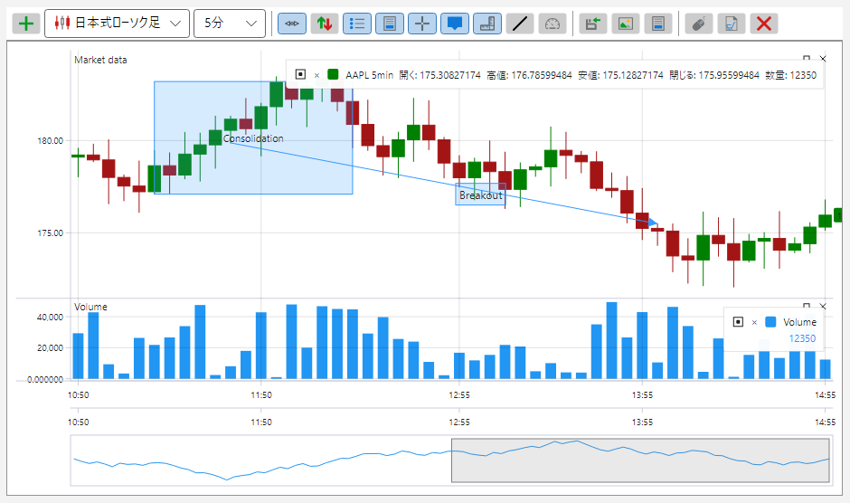
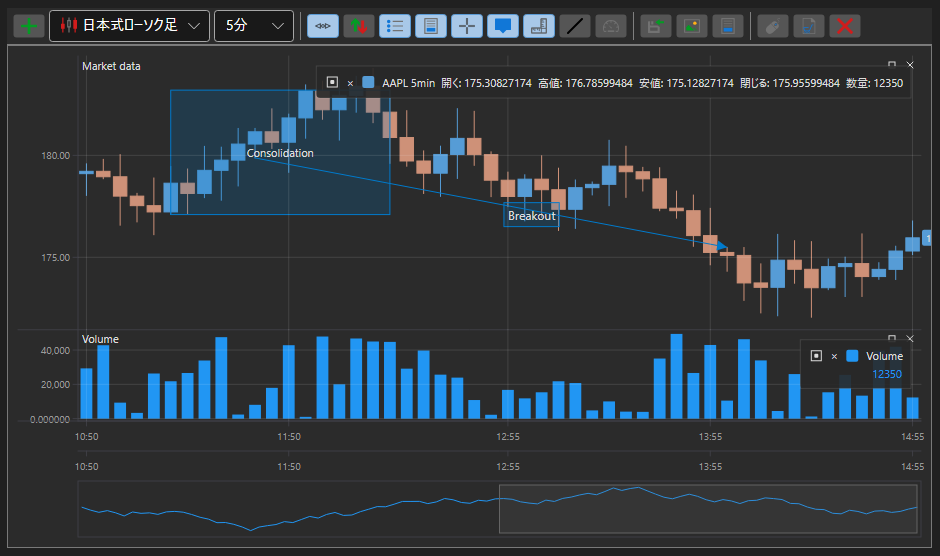

# S# グラフィカルコンポーネントのテーマ

S# のグラフィカルコンポーネントはすべて、ライトとダークの 2 つのテーマで用意されています。テーマはアプリケーションのレベルで一度だけ指定し、それをすべてのコンポーネントが一斉に受け取ります。色は個々のコントロールに書かれているのではなく、リソースから取得されるためです。

ライトテーマ:



ダークテーマ:



テーマを設定するには 1 行書くだけで十分です:

```cs
...
ThemeExtensions.ApplyDefaultTheme();
...
```

**[ThemeExtensions](xref:StockSharp.Xaml.ThemeExtensions) の主なメソッド**

- [ThemeExtensions.ApplyDefaultTheme](xref:StockSharp.Xaml.ThemeExtensions.ApplyDefaultTheme(System.Boolean)) \- ダークまたはライトのテーマを適用します。
- [ThemeExtensions.Invert](xref:StockSharp.Xaml.ThemeExtensions.Invert) \- テーマを反対のものに切り替えます。
- [ThemeExtensions.IsCurrDark](xref:StockSharp.Xaml.ThemeExtensions.IsCurrDark) \- 現在のテーマがダークかどうか。

テーマの変更は直ちに反映されます。アプリケーションを再起動する必要はなく、開いているパネルとチャートはすべて新しい色で描き直されます。

取引コンポーネントに固有の色 \- 上昇と下落、買いと売り、オーダーブックの各レベル、テーブルのグリッド線 \- は別のリソースのまとまりとして存在し、テーマとともに変化します。そのため、色を自分で決めるのではなくこのまとまりから取得する独自のコントロールは、どちらのテーマでも同じようになじんで見えます。
