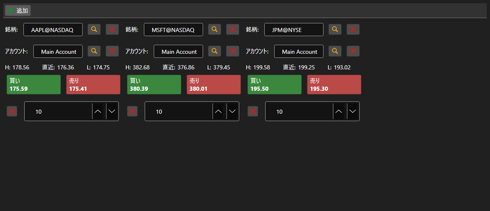

# 売買パネルのセット



[BuySellGrid](xref:StockSharp.Xaml.BuySellGrid) - 銘柄ごとに 1 つずつ配置した複数の [BuySellPanel](xref:StockSharp.Xaml.BuySellPanel) のコンテナです。1 画面から複数銘柄を取引できます。

**主なプロパティ**

- [BuySellGrid.SecurityProvider](xref:StockSharp.Xaml.BuySellGrid.SecurityProvider) - パネルでの選択に使う銘柄プロバイダ。
- [BuySellGrid.Portfolios](xref:StockSharp.Xaml.BuySellGrid.Portfolios) - ポートフォリオのソース。
- [BuySellGrid.MarketDataProvider](xref:StockSharp.Xaml.BuySellGrid.MarketDataProvider) - パネルが最良気配を取得するマーケットデータプロバイダ。
- [BuySellGrid.Panels](xref:StockSharp.Xaml.BuySellGrid.Panels) - 現在のパネルの集合。

パネルは [BuySellGrid.AddPanel](xref:StockSharp.Xaml.BuySellGrid.AddPanel(StockSharp.BusinessEntities.Security)) で追加し、[BuySellGrid.RemovePanel](xref:StockSharp.Xaml.BuySellGrid.RemovePanel(StockSharp.Xaml.BuySellPanel)) で削除します。コンテナは注文を登録せず、銘柄・ポートフォリオ・売買方向・価格・数量を伴う `OrderRegistering` イベントを発生させます。パネル構成は `Save` と `Load` で保存・復元されます。

以下は使用例のコード断片です:

```xaml
<Window x:Class="Sample.BuySellWindow"
	xmlns="http://schemas.microsoft.com/winfx/2006/xaml/presentation"
	xmlns:x="http://schemas.microsoft.com/winfx/2006/xaml"
	xmlns:xaml="http://schemas.stocksharp.com/xaml"
	Height="400" Width="900">
	<xaml:BuySellGrid x:Name="BuySellGrid" />
</Window>
```

```cs
// すべてのパネルのデータソースを設定します
BuySellGrid.SecurityProvider = _connector;
BuySellGrid.MarketDataProvider = _connector;
BuySellGrid.Portfolios = new PortfolioDataSource(_connector);

// 銘柄ごとのパネルを追加します
BuySellGrid.AddPanel(_security);

// パネルが作成した注文を登録します
BuySellGrid.OrderRegistering += (security, portfolio, side, price, volume) =>
{
	_connector.RegisterOrder(new Order
	{
		Security = security,
		Portfolio = portfolio,
		Side = side,
		Price = price,
		Volume = volume,
	});
};
```

## 関連項目

[取引](../trading.md)
