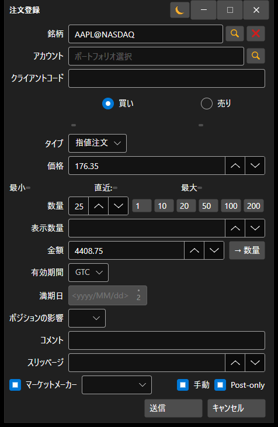

# 新規注文の作成

[OrderWindow](xref:StockSharp.Xaml.OrderWindow) - 注文を作成するためのウィンドウです。



接続が条件付き注文（ストップロス、テイクプロフィット）の登録をサポートしている場合、このウィンドウで **詳細条件** フラグを設定することで、高度な条件を持つ条件付き注文を登録できます。

**基本プロパティ**

- [OrderWindow.Portfolios](xref:StockSharp.Xaml.OrderWindow.Portfolios) - ポートフォリオのリスト。
- [OrderWindow.MarketDataProvider](xref:StockSharp.Xaml.OrderWindow.MarketDataProvider) - マーケットデータプロバイダー。
- [OrderWindow.SecurityProvider](xref:StockSharp.Xaml.OrderWindow.SecurityProvider) - 銘柄情報プロバイダー。
- [OrderWindow.Order](xref:StockSharp.Xaml.OrderWindow.Order) - 作成された注文。

これを使用するコードスニペットを以下に示します。サンプルコードは *Samples\/01\_Basic\/03\_Orders* から取得しています。

```cs
...
private readonly Connector _connector = new Connector();
...
private void NewOrderClick(object sender, RoutedEventArgs e)
{
	var wnd = new OrderWindow
	{
		Order = new Order { Security = SecurityPicker.SelectedSecurity },
		SecurityProvider = _connector,
		MarketDataProvider = _connector,
		Portfolios = new PortfolioDataSource(_connector),
	};
	if (wnd.ShowModal(this))
		_connector.RegisterOrder(wnd.Order);
}
						
	  				
```
