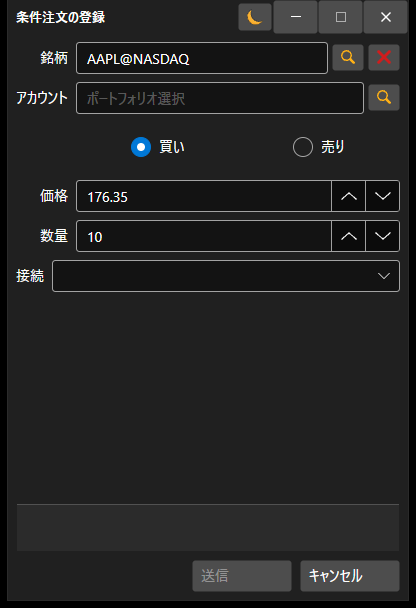

# 新規ストップ注文の作成

[OrderConditionalWindow](xref:StockSharp.Xaml.OrderConditionalWindow) - 条件付き注文を作成するためのウィンドウです。



**主なプロパティ**

- [OrderConditionalWindow.Portfolios](xref:StockSharp.Xaml.OrderConditionalWindow.Portfolios) - ポートフォリオのリスト。
- [OrderConditionalWindow.SecurityProvider](xref:StockSharp.Xaml.OrderConditionalWindow.SecurityProvider) - 銘柄に関する情報のプロバイダー。
- [OrderConditionalWindow.MarketDataProvider](xref:StockSharp.Xaml.OrderConditionalWindow.MarketDataProvider) - マーケットデータのプロバイダー。
- [OrderConditionalWindow.Adapter](xref:StockSharp.Xaml.OrderConditionalWindow.Adapter) - メッセージアダプター。
- [OrderConditionalWindow.Order](xref:StockSharp.Xaml.OrderConditionalWindow.Order) - 作成された注文。

以下は、その使用方法を示すコードスニペットです。コード例は *Samples\/InteractiveBrokers\/SampleIB* から取得しています。

```cs
...
private readonly Connector _connector = new Connector();
...
private void NewStopOrderClick(object sender, RoutedEventArgs e)
{
	var wnd = new OrderConditionalWindow
	{
		Order = new Order
		{
			Security = SecurityPicker.SelectedSecurity,
			Type = OrderTypes.Conditional,
			ExpiryDate = DateTime.Today
		},
		SecurityProvider = _connector,
		MarketDataProvider = _connector,
		Portfolios = new PortfolioDataSource(_connector),
		Adapter = _connector.Adapter
	};
	if (wnd.ShowModal(this))
		_connector.RegisterOrder(wnd.Order);
}
						
	  				
```

