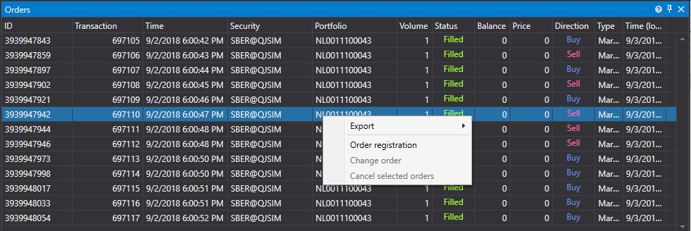

# 注文

[OrderGrid](xref:StockSharp.Xaml.OrderGrid) は、注文および条件付き注文を表示するためのテーブルです。さらに、このテーブルのコンテキストメニューには、注文に対する操作（注文の登録、差し替え、キャンセル）のコマンドが含まれています。メニュー項目を選択すると、それぞれ [OrderGrid.OrderRegistering](xref:StockSharp.Xaml.OrderGrid.OrderRegistering)、[OrderGrid.OrderReRegistering](xref:StockSharp.Xaml.OrderGrid.OrderReRegistering)、または [OrderGrid.OrderCanceling](xref:StockSharp.Xaml.OrderGrid.OrderCanceling) イベントが生成されます。



> [!TIP]
> 操作そのもの（登録、差し替え、キャンセル）は実行されません。対応するコードをイベントハンドラー内に手動で記述する必要があります。

**主なメンバー**

- [OrderGrid.Orders](xref:StockSharp.Xaml.OrderGrid.Orders) - 注文のリスト。
- [OrderGrid.SelectedOrder](xref:StockSharp.Xaml.OrderGrid.SelectedOrder) - 選択された注文。
- [OrderGrid.SelectedOrders](xref:StockSharp.Xaml.OrderGrid.SelectedOrders) - 選択された注文。
- [OrderGrid.AddRegistrationFail](xref:StockSharp.Xaml.OrderGrid.AddRegistrationFail(StockSharp.BusinessEntities.OrderFail))**(**[StockSharp.BusinessEntities.OrderFail](xref:StockSharp.BusinessEntities.OrderFail) fail **)** - 注文登録エラーメッセージをコメントフィールドに追加するメソッド。
- [OrderGrid.OrderRegistering](xref:StockSharp.Xaml.OrderGrid.OrderRegistering) - 注文登録イベント（対応するコンテキストメニュー項目を選択した後に発生）。
- [OrderGrid.OrderReRegistering](xref:StockSharp.Xaml.OrderGrid.OrderReRegistering) - 注文差し替えイベント（対応するコンテキストメニュー項目を選択した後に発生）。
- [OrderGrid.OrderCanceling](xref:StockSharp.Xaml.OrderGrid.OrderCanceling) - 注文キャンセルイベント（対応するコンテキストメニュー項目を選択した後に発生）。

以下は、その使用方法を示すコード片です。コード例は *Samples\/01\_Basic\/03\_Orders* から取得しています。

```xaml
<Window x:Class="Sample.OrdersWindow"
	xmlns="http://schemas.microsoft.com/winfx/2006/xaml/presentation"
	xmlns:x="http://schemas.microsoft.com/winfx/2006/xaml"
	xmlns:loc="clr-namespace:StockSharp.Localization;assembly=StockSharp.Localization"
	xmlns:xaml="http://schemas.stocksharp.com/xaml"
	Title="{x:Static loc:LocalizedStrings.Orders}" Height="410" Width="930">
	<xaml:OrderGrid x:Name="OrderGrid" x:FieldModifier="public" 
					OrderCanceling="OrderGrid_OnOrderCanceling" 
					OrderReRegistering="OrderGrid_OnOrderReRegistering" />
</Window>
	  				
```
```cs
private readonly Connector _connector = new Connector();

private void ConnectClick(object sender, RoutedEventArgs e)
{
	// 接続中のその他のコード...
	
	// 注文受信イベントをサブスクライブします
	_connector.OrderReceived += (subscription, order) => 
	{
		// OrderGrid テーブルに注文を追加します
		_ordersWindow.OrderGrid.Orders.TryAdd(order);
	};
	
	// コネクターに接続します
	_connector.Connect();
}
					
// 選択されたすべての注文をキャンセルします
private void OrderGrid_OnOrderCanceling(IEnumerable<Order> orders)
{
	// 選択された注文を反復処理し、それぞれをキャンセルします
	foreach (var order in orders)
	{
		_connector.CancelOrder(order);
	}
}

// 注文編集ウィンドウを開き、選択された注文の差し替えを実行します
private void OrderGrid_OnOrderReRegistering(Order order)
{
	var window = new OrderWindow
	{
		Title = LocalizedStrings.Str2976Params.Put(order.TransactionId),
		SecurityProvider = _connector,
		MarketDataProvider = _connector,
		Portfolios = new PortfolioDataSource(_connector),
		Order = order.ReRegisterClone(newVolume: order.Balance)
	};
	
	if (window.ShowModal(this))
		_connector.ReRegisterOrder(order, window.Order);
}
	  				
```

## サブスクリプションを通じた注文の操作

注文を操作する最新の方法では、サブスクリプションを使用します。

```cs
// 注文受信イベントをサブスクライブします
_connector.OrderReceived += OnOrderReceived;

// 注文受信ハンドラー
private void OnOrderReceived(Subscription subscription, Order order)
{
	// 注文が対象のサブスクリプションに属しているか確認します
	if (subscription == _ordersSubscription)
	{
		// 注文をテーブルに追加します
		_ordersWindow.OrderGrid.Orders.TryAdd(order);
		
		// 追加の注文処理
		Console.WriteLine($"Order received: {order.TransactionId}, Status: {order.State}");
		
		// 注文が最終状態の場合、UI を更新します
		if (order.State == OrderStates.Done || order.State == OrderStates.Failed)
		{
			this.GuiAsync(() => {
				// 完了した注文のインターフェイスを更新します
			});
		}
	}
}
```

## 注文のキャンセル

```cs
// 注文キャンセルの最新の方法
private void CancelOrder(Order order)
{
	try
	{
		_connector.CancelOrder(order);
		
		// アクションをログに記録します
		_logManager.AddInfoLog($"Order cancellation command sent {order.TransactionId}");
	}
	catch (Exception ex)
	{
		_logManager.AddErrorLog($"Error when canceling order: {ex.Message}");
	}
}

// 注文の一括キャンセル
private void CancelAllOrders()
{
	var activeOrders = _ordersWindow.OrderGrid.Orders
		.Where(o => o.State == OrderStates.Active)
		.ToArray();
		
	foreach (var order in activeOrders)
	{
		CancelOrder(order);
	}
}
```

## 注文登録およびキャンセルエラーの処理

```cs
// 注文登録失敗をサブスクライブします
_connector.OrderRegisterFailReceived += OnOrderRegisterFailed;

// 注文登録失敗ハンドラー
private void OnOrderRegisterFailed(Subscription subscription, OrderFail fail)
{
	// エラー情報を OrderGrid に追加します
	_ordersWindow.OrderGrid.AddRegistrationFail(fail);
	
	// エラーをログに記録します
	_logManager.AddErrorLog($"Order registration error: {fail.Error}");
	
	// ユーザーに通知します
	this.GuiAsync(() => 
	{
		MessageBox.Show(this, 
			$"Failed to register order: {fail.Error}", 
			"Registration Error", 
			MessageBoxButton.OK, 
			MessageBoxImage.Error);
	});
}
```
