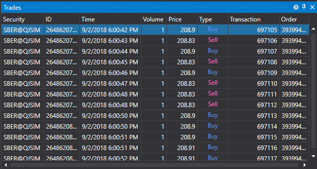

# 自分の約定

[MyTradeGrid](xref:StockSharp.Xaml.MyTradeGrid) - 自分の約定を表示するためのテーブルです。



**主なメンバー**

- [MyTradeGrid.Trades](xref:StockSharp.Xaml.MyTradeGrid.Trades) - 約定のリスト。
- [MyTradeGrid.SelectedTrade](xref:StockSharp.Xaml.MyTradeGrid.SelectedTrade) - 選択された約定。
- [MyTradeGrid.SelectedTrades](xref:StockSharp.Xaml.MyTradeGrid.SelectedTrades) - 選択された約定。

以下は、その使用方法を含むコードスニペットです。コード例は *Samples\/InteractiveBrokers\/SampleIB.* から取得しています。

```xaml
<Window x:Class="Sample.MyTradesWindow"
	xmlns="http://schemas.microsoft.com/winfx/2006/xaml/presentation"
	xmlns:x="http://schemas.microsoft.com/winfx/2006/xaml"
	xmlns:loc="clr-namespace:StockSharp.Localization;assembly=StockSharp.Localization"
	xmlns:xaml="http://schemas.stocksharp.com/xaml"
	Title="{x:Static loc:LocalizedStrings.MyTrades}" Height="284" Width="644">
	<xaml:MyTradeGrid x:Name="TradeGrid" x:FieldModifier="public" />
</Window>
	  				
```
```cs
private readonly Connector _connector = new Connector();
private void ConnectClick(object sender, RoutedEventArgs e)
{
		...............................................
		_connector.OwnTradeReceived += trade => _myTradesWindow.TradeGrid.Trades.Add(trade);
			
		...............................................
}
	  				
```

