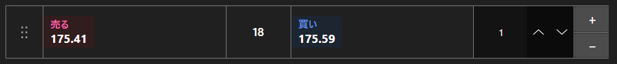

# クイック注文パネル



[QuickOrderPanel](xref:StockSharp.Xaml.QuickOrderPanel) - ワンクリックで発注できるコンパクトなパネルです。最良買値・最良売値、スプレッド、注文数量を表示し、いずれかのサイドを押すとすぐに注文が作成されます。

**主なプロパティ**

- [QuickOrderPanel.Security](xref:StockSharp.Xaml.QuickOrderPanel.Security) - 注文を出す銘柄。
- [QuickOrderPanel.Volume](xref:StockSharp.Xaml.QuickOrderPanel.Volume) - 注文数量。
- [QuickOrderPanel.BuyBackground](xref:StockSharp.Xaml.QuickOrderPanel.BuyBackground) - 買いサイドの背景。
- [QuickOrderPanel.SellBackground](xref:StockSharp.Xaml.QuickOrderPanel.SellBackground) - 売りサイドの背景。

パネル自身は注文を登録しません。[Order](xref:StockSharp.BusinessEntities.Order) オブジェクトを作成して `RegisterOrder` イベントに渡すだけです。ポートフォリオや追加のチェックはハンドラで行います。数量や外観の変更時には `SettingsChanged` が発生するため、設定の保存に利用できます。

以下は使用例のコード断片です:

```xaml
<Window x:Class="Sample.QuickOrderWindow"
	xmlns="http://schemas.microsoft.com/winfx/2006/xaml/presentation"
	xmlns:x="http://schemas.microsoft.com/winfx/2006/xaml"
	xmlns:xaml="http://schemas.stocksharp.com/xaml"
	Height="300" Width="260">
	<xaml:QuickOrderPanel x:Name="QuickOrderPanel" Volume="10" />
</Window>
```

```cs
// 銘柄を設定します。パネルはその最良気配を購読します
QuickOrderPanel.Security = _security;

// パネルが注文を作成し、登録は自分で行います
QuickOrderPanel.RegisterOrder += order =>
{
	order.Portfolio = _portfolio;
	_connector.RegisterOrder(order);
};

// 設定が変わったら保存します
QuickOrderPanel.SettingsChanged += () => SaveSettings();
```

## 関連項目

[取引](../trading.md)
