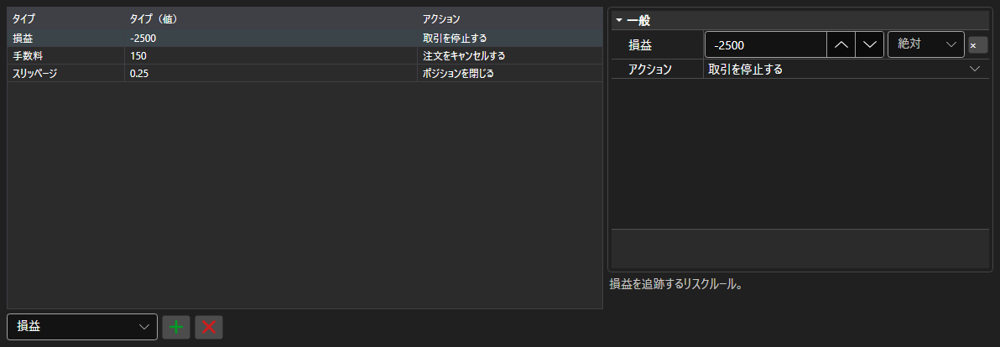

# リスク管理ルール



[RiskPanel](xref:StockSharp.Xaml.RiskPanel) - リスク管理ルールのテーブルです。[IRiskRule](xref:StockSharp.Algo.Risk.IRiskRule) ルールの追加・削除・設定ができ、各ルールには発動条件とアクションを指定します。

**主なプロパティ**

- [RiskPanel.Rules](xref:StockSharp.Xaml.RiskPanel.Rules) - ルールの一覧。[IRiskManager](xref:StockSharp.Algo.Risk.IRiskManager) が使うものと同じリストです。

左はルールの一覧で、種類、条件の値、発動時のアクションが並びます。右には選択したルールのプロパティが、種類ごとに異なる形で表示されます。新しいルールは表の下の一覧で種類を選んで追加し、不要なものは隣のボタンで削除します。列構成と列幅は `Save` と `Load` で保存されます。

以下は使用例のコード断片です:

```xaml
<Window x:Class="Sample.RiskWindow"
	xmlns="http://schemas.microsoft.com/winfx/2006/xaml/presentation"
	xmlns:x="http://schemas.microsoft.com/winfx/2006/xaml"
	xmlns:xaml="http://schemas.stocksharp.com/xaml"
	Height="400" Width="700">
	<xaml:RiskPanel x:Name="RiskPanel" />
</Window>
```

```cs
// 現在のリスクマネージャのルールを表示します
RiskPanel.Rules.AddRange(_connector.RiskManager.Rules);

// 損失時に取引を停止するルールを追加します
RiskPanel.Rules.Add(new RiskPnLRule
{
	PnL = -1000,
	Action = RiskActions.StopTrading,
});

// 編集したルールをリスクマネージャへ戻します
_connector.RiskManager.Rules.Clear();
_connector.RiskManager.Rules.AddRange(RiskPanel.Rules);
```

## 関連項目

[取引](../trading.md)
