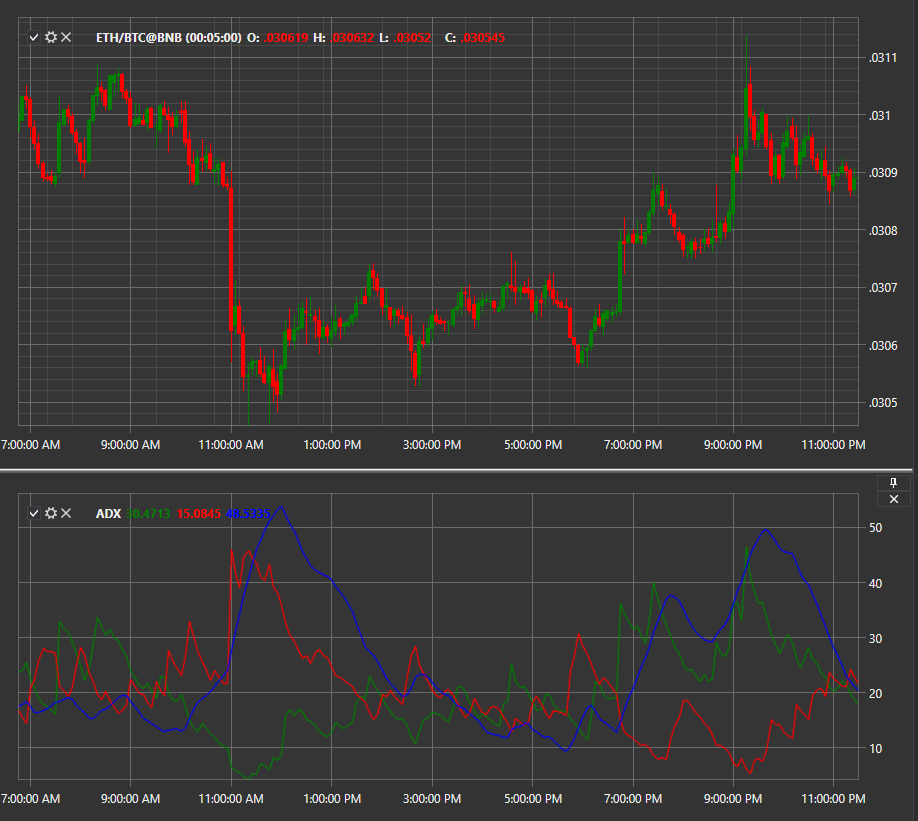

# ADX

**Welles Wilder の ADX (平均方向性指数)** は方向性移動インジケーターのグループです。ADX、DI+、DI- のラインが 方向性指数 (DMI) を構成します。ADX はトレンドの強さを示し、DI+ と DI- は現在の価格方向を示します。

このインジケーターを使用するには、[AverageDirectionalIndex](xref:StockSharp.Algo.Indicators.AverageDirectionalIndex) を使用する必要があります。

## 推奨コンテンツ

[ATR](atr.md)
