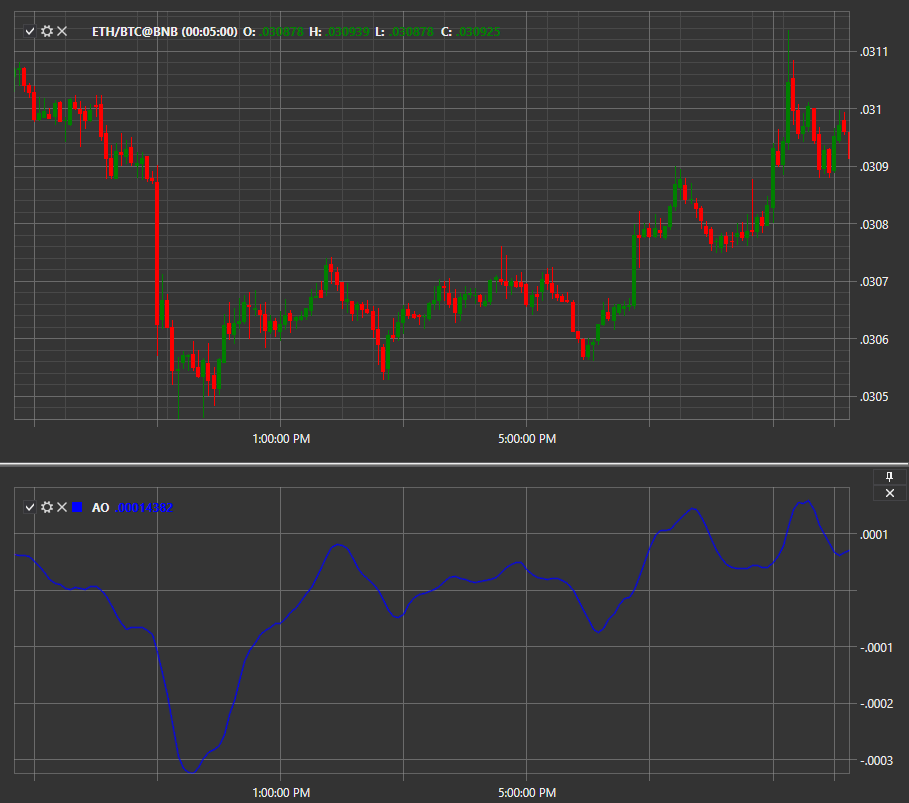

# AO

**Awesome Oscillator (AO)** は、異なる期間の移動平均（SMA）を差し引いて構築される古典的なテクニカルインジケーターです。

このインジケーターを使用するには、[AwesomeOscillator](xref:StockSharp.Algo.Indicators.AwesomeOscillator) クラスを使用します。
##### 計算

Awesome Oscillator のヒストグラムは、バーの中心値 (H+L) / 2 に基づいて構築された 5 期間単純移動平均から、同じ中心値 (H+L) / 2 に基づく 34 期間単純移動平均を差し引いたものです。つまり、価格変動の強さと今後の意図を把握するために、低速の移動平均ラインを高速の移動平均ラインから差し引きます。

MEDIAN PRICE = (HIGH + LOW) / 2  
AO = SMA (MEDIAN PRICE, 5) - SMA (MEDIAN PRICE, 34), ここで  
  
MEDIAN PRICE - 中央価格  
HIGH - バーの最高価格  
LOW - バーの最低価格  
SMA - 単純移動平均

値はクラシックなインジケーター用のものであり、設定では常に独自のパラメーターを指定できます。

## 関連項目

[Bollinger Bands](bollinger_bands.md)
