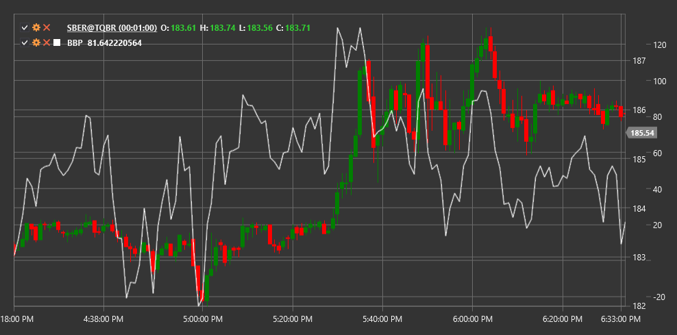

# BBP

**ボリンジャーパーセント B (BBP)** は、John Bollinger によってボリンジャーバンドインジケーターを補完するものとして開発されたインジケーターです。BBP は、上側および下側のボリンジャーバンドに対する価格の位置を示します。

このインジケーターを使用するには、[BollingerPercentB](xref:StockSharp.Algo.Indicators.BollingerPercentB) クラスを使用する必要があります。

## 説明

ボリンジャーパーセント B インジケーターは、上側および下側のボリンジャーバンドに対する価格位置を、0 から 1（または 0% から 100%）のパーセント値として判断します。これにより、ボリンジャーバンドの文脈で価格位置をより正確に判断できます。

- 値 1（または 100%）は、価格が上側ボリンジャーバンドにあることを意味します。
- 値 0（または 0%）は、価格が下側ボリンジャーバンドにあることを意味します。
- 値 0.5（または 50%）は、価格が中央のボリンジャーバンド（SMA）にあることを意味します。

BBP は 0-1 の範囲外の値を取ることもあります。
- 1 を超える値は、価格が上側ボリンジャーバンドを上回っていることを示します。
- 0 未満の値は、価格が下側ボリンジャーバンドを下回っていることを示します。

## パラメーター

このインジケーターには次のパラメーターがあります。
- **期間** - SMA の計算期間（既定値: 20）
- **標準偏差乗数** - ボリンジャーバンドを計算するための標準偏差乗数（既定値: 2）

## 計算

ボリンジャーパーセント B の計算は次の式に基づいています。

```
BBP = (Price - 下側ボリンジャーバンド) / (上側ボリンジャーバンド - 下側ボリンジャーバンド)
```

ここで:
- Price - 現在価格（通常は終値）
- 下側ボリンジャーバンド = SMA - (StdDevMultiplier * 標準偏差)
- 上側ボリンジャーバンド = SMA + (StdDevMultiplier * 標準偏差)
- SMA - Length 期間の単純移動平均
- 標準偏差 - Length 期間の価格標準偏差

## 使用方法

ボリンジャーパーセント B はさまざまな方法で使用できます。

1. **買われ過ぎ/売られ過ぎ状態の特定**:
   - 1 を超える値は、市場が買われ過ぎであることを示します
   - 0 未満の値は、市場が売られ過ぎであることを示します

2. **反転シグナル**:
   - BBP が範囲外に出た後、0-1 の範囲へ戻る場合
   - BBP と価格の間のダイバージェンス

3. **トレンド判定**:
   - BBP の値が一貫して 0.5 を上回る場合、上昇トレンドを示します
   - BBP の値が一貫して 0.5 を下回る場合、下降トレンドを示します

4. **隠れたサポートおよびレジスタンス水準の発見**:
   - 0.8 と 0.2 の水準は、追加のサポートおよびレジスタンス水準としてよく使用されます



## 関連項目

[BollingerBands](bollinger_bands.md)
[StdDev](standard_deviation.md)
[RSI](rsi.md)
