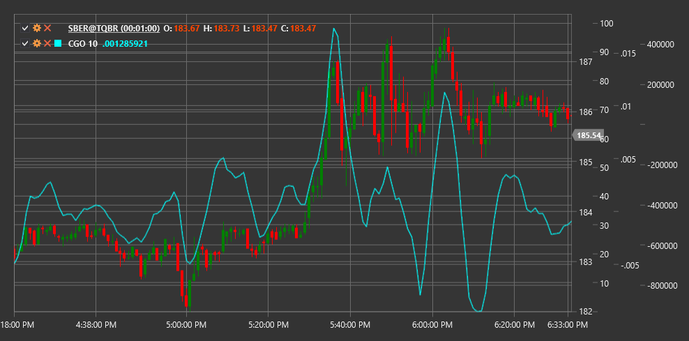

# CGO

**重心オシレーター (CGO)** は、John Ehlers によって開発されたテクニカルインジケーターで、物理学における重心の概念に基づき、市場の価格変動の分析に適用されます。

このインジケーターを使用するには、[CenterOfGravityOscillator](xref:StockSharp.Algo.Indicators.CenterOfGravityOscillator) クラスを使用する必要があります。

## 説明

重心オシレーター (CGO) は、価格系列を物理的なシステムとして扱い、その「重心」を判断することで、市場の反転ポイントを特定しようとする先行インジケーターです。このインジケーターは、現在の価格変動における「均衡」がどこにあるかを計算し、その情報を使用して将来のトレンド方向の変化を予測します。

CGO は特に次の用途に有用です。
- 価格チャートに現れる前に潜在的な反転ポイントを特定する
- 現在のトレンドの強さと弱さを明らかにする
- 価格とインジケーターの間の隠れたダイバージェンスを検出する
- 先行シグナルに基づく取引システムを作成する

## パラメーター

このインジケーターには次のパラメーターがあります。
- **Length** - 計算期間（既定値: 10）

## 計算

重心オシレーター (CGO) の計算は次の式に基づいています。

```
CGO = - Sum(Price(i) * (i + 1)) / Sum(Price(i))
```

ここで:
- i - 0 から (Length-1) までの期間内の価格値インデックス
- Price(i) - 対応するインデックス i の価格（通常は終値）
- Sum - Length 期間内のすべての値の合計

この式では、各価格が時系列内での位置によって重み付けされ、その後、価格の合計によって正規化されます。式の前のマイナス記号は、価格が上昇したときにインジケーターも上昇するようにするために追加されており、より直感的になります。

## 解釈

- **ゼロラインのクロス**: CGO がゼロラインを下から上へクロスする場合、これは強気シグナルと見なすことができます。上から下へのクロスは弱気シグナルを示す場合があります。

- **インジケーターの極値**: CGO が極値（最大値または最小値）に達する場合、潜在的なトレンド反転を示すことがあります。

- **ダイバージェンス**: 
  - 強気ダイバージェンス: 価格が新安値を形成しているが、CGO がそれを確認せず、より高い安値を形成する場合。
  - 弱気ダイバージェンス: 価格が新高値に達しているが、CGO がより低い高値を形成する場合。

- **インジケーターの動き**: CGO が一方向へ急速に動く場合、新しいトレンドの始まりを示すことがあります。インジケーターがゆっくり動く、またはゼロライン付近で振動する場合、市場の保ち合いを示すことがあります。

CGO は先行インジケーターであるため、そのシグナルは価格チャート上の対応する変化より前に現れることが多く、トレーダーが取引判断を行ううえで優位性をもたらします。



## 関連項目

[SineWave](sine_wave.md)
[HarmonicOscillator](harmonic_oscillator.md)
[FisherTransform](ehlers_fisher_transform.md)
[RVI](rvi.md)
