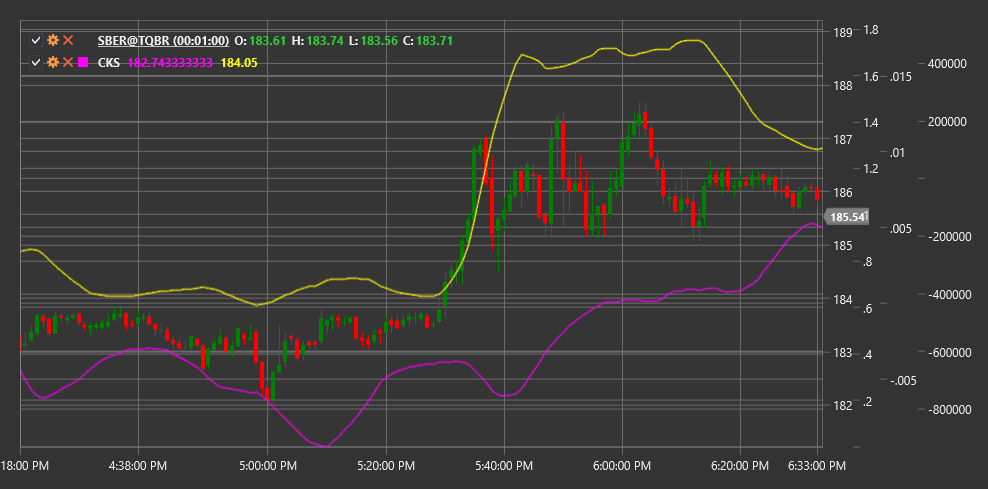

# CKS

**Chande Kroll Stop (CKS)** は、Tushar Chande と Stanley Kroll によって開発されたストップロス水準を決定するためのインジケーターです。市場のボラティリティに適応し、トレーダーがポジションの手仕舞いポイントを設定するのに役立ちます。

このインジケーターを使用するには、[ChandeKrollStop](xref:StockSharp.Algo.Indicators.ChandeKrollStop) クラスを使用する必要があります。

## 説明

Chande Kroll Stop インジケーターは、市場のボラティリティとトレンドの変化に反応する、ストップロス水準を設定するための動的なツールとして開発されました。これは 2 本のラインで構成されます。上側のストップライン（ショートポジション用）と下側のストップライン（ロングポジション用）です。

CKS の主な利点は、現在の市場状況に適応できる点にあります。ボラティリティが高い期間には、ストップラインは価格からより離れた位置に配置され、市場ノイズによる早すぎるポジション決済を避けるのに役立ちます。ボラティリティが低い期間には、ストップラインは価格に近づき、よりタイトなトレンドフォローを可能にします。

CKS は特に次の用途に役立ちます。
- ロングおよびショートポジションのストップロス水準の決定
- 適応的なリスク管理によるトレンド追随
- 潜在的なトレンド反転ポイントの特定
- 明確な出口ルールを持つ機械的な取引システムの作成

## パラメーター

このインジケーターには次のパラメーターがあります。
- **Period** - 極値を計算するための主期間（既定値: 10）
- **Multiplier** - ATR の乗数で、極値からの距離を決定します（既定値: 1.5）
- **StopPeriod** - ストップ水準を計算するための期間（既定値: 20）

## 計算

Chande Kroll Stop の計算には、次の手順が含まれます。

1. Period にわたる高値と安値の極値を決定します。
   ```
   HighestHigh = Period における High の最大値
   LowestLow = Period における Low の最小値
   ```

2. Period にわたる平均真の値幅 (ATR) を計算します。
   ```
   ATR = Period における TR の平均値
   ```

3. 上側および下側のバンドを計算します。
   ```
   上限バンド = HighestHigh - (乗数 * ATR)
   下限バンド = LowestLow + (乗数 * ATR)
   ```

4. StopPeriod に基づいて最終的なストップラインを決定します。
   ```
   Upper Stop = StopPeriod における上側バンドの最大値
   Lower Stop = StopPeriod における下側バンドの最小値
   ```

## 解釈

- **Upper Stop** はショートポジションに使用されます。終値が上側ストップを上回った場合、ショートポジションを決済する、またはロングポジションを建てるシグナルと見なすことができます。

- **Lower Stop** はロングポジションに使用されます。終値が下側ストップを下回った場合、ロングポジションを決済する、またはショートポジションを建てるシグナルと見なすことができます。

- **価格がストップラインを交差すること** は、潜在的なトレンド反転、または新しいモメンタムの始まりを示す場合があります。

- **ストップラインの急激な変化** は、市場ボラティリティが大きく変化したときに発生することがあります。

- **他のインジケーターとの併用**: CKS は、市場へのエントリー方向を判断するのに役立つ他のトレンド系およびモメンタム系インジケーターと組み合わせると最も効果的です。



## 関連項目

[ATR](atr.md)
[ParabolicSAR](parabolic_sar.md)
[DonchianChannels](donchian_channels.md)
