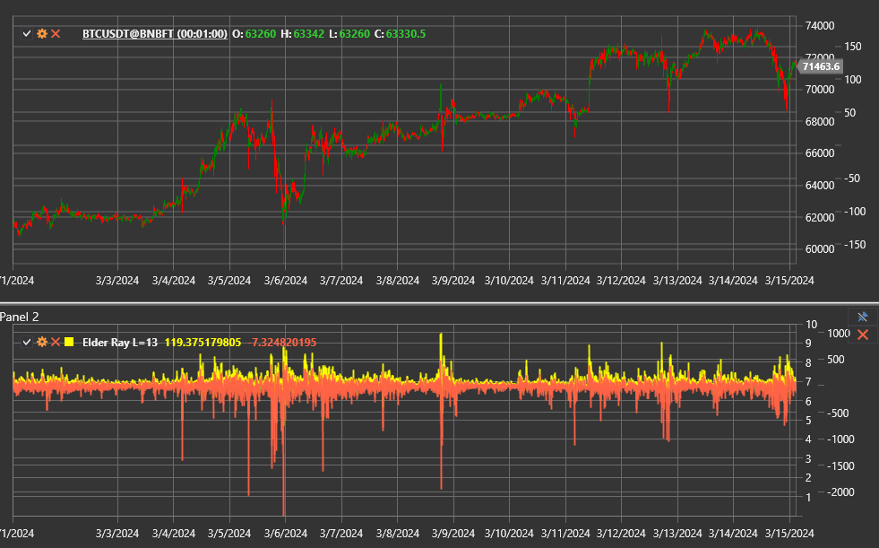

# エルダー・レイ

**エルダー・レイ Index** は、Alexander Elder による複合インジケーターで、指数移動平均とブルパワー
およびベアパワーオシレーターを組み合わせます。買い手と売り手のバランスを可視化し、どちらか一方が主導権を失うタイミングを特定するのに役立ちます。

このインジケーターにアクセスするには、[ElderRay](xref:StockSharp.Algo.Indicators.ElderRay) クラスを使用します。

## 構成要素

このインジケーターは、次を含む [ElderRayValue](xref:StockSharp.Algo.Indicators.ElderRayValue) 構造体を返します。

- **EMA** - 終値の基準となる指数移動平均。
- **ブルパワー** - バーの高値と EMA の距離。
- **ベアパワー** - バーの安値と EMA の距離。

## パラメーター

エルダー・レイは [ExponentialMovingAverage](xref:StockSharp.Algo.Indicators.ExponentialMovingAverage) の設定を継承します。

- **期間** - EMA 期間。
- **アルファ** - 直接構成する場合の平滑化係数。

## 解釈

- **ブルパワー > 0** と上昇する EMA が同時に見られる場合、上昇トレンドを確認します。
- **ベアパワー < 0** と下降する EMA が同時に見られる場合、下降トレンドを確認します。
- 上昇価格でブルパワーが縮小する場合、または下落価格でベアパワーが上昇する場合、ダイバージェンスを形成し、反転を警告します。
- ブルパワーまたはベアパワーのゼロラインクロスは、市場支配の移行を示します。

取引判断は、EMA と両方のオシレーターを同時に分析して行います。たとえば、買い機会は、
EMA が上昇し、ベアパワーが直近の安値から回復し、ブルパワーがゼロを上抜けたときに現れます。

## 関連項目

[ブルパワー](bull_power.md)
[ベアパワー](bear_power.md)
[指数移動平均](ema.md)
