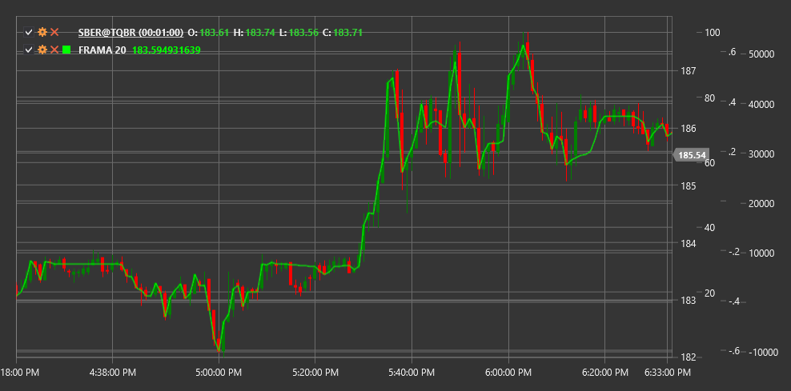

# FRAMA

**フラクタル適応移動平均 (FRAMA)** は、John Ehlers によって開発されたテクニカルインジケーターで、市場のフラクタル次元に基づいて価格変化への反応速度を適応させます。

このインジケーターを使用するには、[FractalAdaptiveMovingAverage](xref:StockSharp.Algo.Indicators.FractalAdaptiveMovingAverage) クラスを使用する必要があります。

## 説明

フラクタル適応移動平均 (FRAMA) は、指数移動平均 (EMA) の高度な一種で、市場のフラクタル次元に基づいて価格変化に対する感度を自動的に調整します。このインジケーターは John Ehlers によって開発され、2000 年 10 月に Technical Analysis of Stocks & Commodities 誌で紹介されました。

FRAMA はフラクタル幾何の概念を使用して市場構造を分析します。現在の市場がどの程度「フラクタル」または混沌としているかを判断し、それに基づいてインジケーターの応答速度を調整します:

- トレンドがある (フラクタル性が低い) 市場環境では、FRAMA は短期 EMA と同様に価格変化へ素早く反応します
- 横ばいの (フラクタル性が高い) 市場環境では、FRAMA は長期 EMA と同様によりゆっくり反応します

これにより、FRAMA は重要な価格変動により速く反応し、市場ノイズを無視できるため、従来の移動平均と比べてより効果的になります。

## パラメーター

このインジケーターには次のパラメーターがあります:
- **Length** - 計算期間 (デフォルト値: 10-20)

## 計算

FRAMA の計算には複数の手順が含まれます:

1. 高値-安値の価格長と期間数の対数比に基づいてフラクタル次元 (D) を計算します:
   ```
   N1 = High(1...Length/2) - Low(1...Length/2)
   N2 = High(Length/2+1...Length) - Low(Length/2+1...Length)
   N3 = High(1...Length) - Low(1...Length)
   
   D = (log(N1 + N2) - log(N3)) / log(2)
   ```

2. フラクタル次元を指数平滑化のためのアルファ係数に変換します:
   ```
   平滑化係数 = exp(-4.6 * (D - 1))
   Alpha = 平滑化係数 * 平滑化係数
   ```

3. アルファ係数を現在価格と前回の FRAMA 値に適用します:
   ```
   FRAMA = Alpha * Price + (1 - Alpha) * FRAMA[previous]
   ```

ここで:
- High - 期間内の最高価格
- Low - 期間内の最低価格
- log - 自然対数

## 解釈

FRAMA は他の移動平均と同様に解釈できますが、その適応的な性質を考慮します:

1. **FRAMA の方向**:
   - 上向きの FRAMA は上昇トレンドを示します
   - 下向きの FRAMA は下降トレンドを示します

2. **価格とのクロスオーバー**:
   - 価格が FRAMA を下から上へクロスした場合、強気シグナルと見なすことができます
   - 価格が FRAMA を上から下へクロスした場合、弱気シグナルと見なすことができます

3. **複数の FRAMA のクロスオーバー**:
   - 短期 FRAMA が長期 FRAMA を下から上へクロスすると、上昇トレンドの開始を示す可能性があります
   - 短期 FRAMA が長期 FRAMA を上から下へクロスすると、下降トレンドの開始を示す可能性があります

4. **FRAMA の傾斜角**:
   - 急な傾斜角は強いトレンドを示します
   - 緩やかな傾斜角は弱いトレンドを示します
   - 水平の動きは横ばいトレンドを示します

5. **シグナルのフィルタリング**:
   - 適応的な性質により、FRAMA は従来の移動平均よりも誤シグナルが少なくなります
   - FRAMA の期間が短いほど、インジケーターは価格変化に対してより敏感になります

6. **サポート水準とレジスタンス水準**:
   - FRAMA は上昇トレンドにおいて動的なサポート水準として機能することがあります
   - FRAMA は下降トレンドにおいて動的なレジスタンス水準として機能することがあります



## 関連項目

[EMA](ema.md)
[KAMA](kama.md)
[VIDYA](vidya.md)
