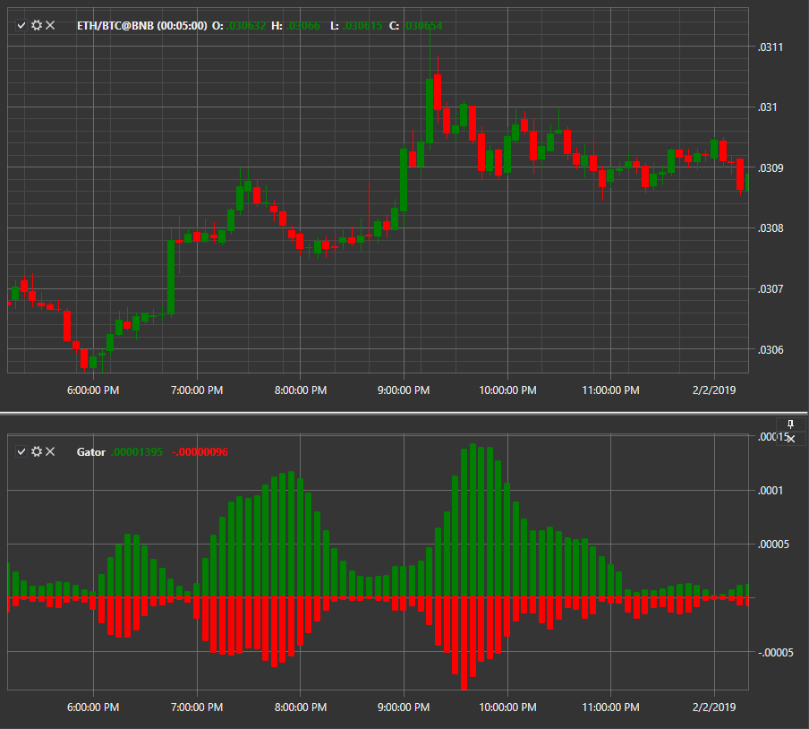

# ゲーターオシレーター

**ゲーターオシレーター** は Bill Williams によって開発されたオシレーターです。類似する Alligator インジケーターと密接に関連しています。トレンドインジケーターとして、強い方向性のある動きを示す市場で最も有用です。

このインジケーターを使用するには、[GatorOscillator](xref:StockSharp.Algo.Indicators.GatorOscillator) クラスを使用する必要があります。

## 推奨コンテンツ

[最大値](highest.md)

