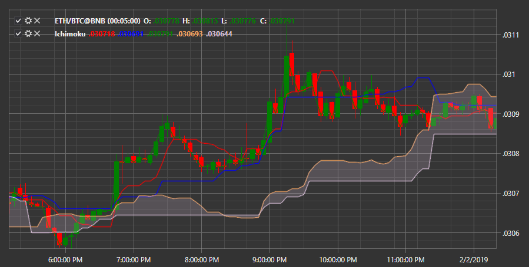

# Ichimoku

**Ichimoku** は、5本のラインの組み合わせで表される指標で、そのうち3本は移動平均、2本はそれらから派生したものです。Ichimoku はトレンドの存在を識別し、サポート/レジスタンスゾーンとトレンドの押し戻しも示します。

この指標を使用するには、[Ichimoku](xref:StockSharp.Algo.Indicators.Ichimoku) クラスを使用する必要があります。
##### Ichimoku 指標の説明
  
グラフィカルには、この指標は単純移動平均に似た5本の色付きラインで構成されます。  
  
- Tenkan (転換線) - 最も速いラインで、価格変化に最初に反応します。主な目的は短期トレンドの方向を判断することです。古典的なバージョンでは、過去9本のバーの区間を使用します。最高値と最安値の合計の半分として構築されます。  
  
- Kijun (基準線) - 期間 26 の中期トレンドを示します。  
  
- Senkou A と Senkou B - 26期間先に投影されて表示され、これらが一緒になって雲 (Kumo) と呼ばれるものを形成します。これはサポートとレジスタンスの領域を示し、指標の重要な構成要素です。  
  
- Chikou (遅行スパン) - 最後の終値を 26 期間後方にシフトして表します。シグナルの確認に役立ちます。下から上へチャートを横切る場合は買いシグナル、上から下へ横切る場合は売りシグナルです。本質的に、Chikou はトレンドフィルターとして機能します。  

## 関連項目

[JMA](jma.md)
