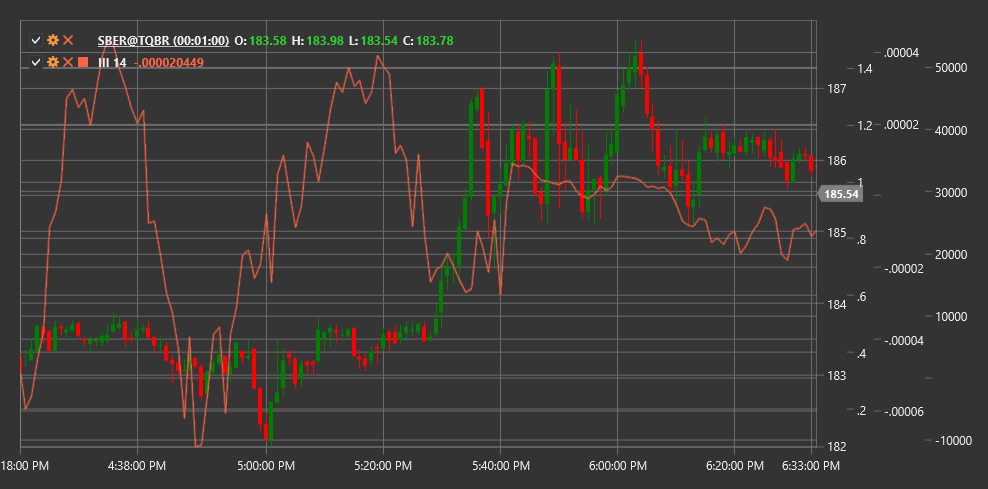

# III

**日中強度指数 (III)** は、David Bostian によって開発されたテクニカル指標で、取引日内の終値、価格レンジ、取引量の関係を評価します。

この指標を使用するには、[IntradayIntensityIndex](xref:StockSharp.Algo.Indicators.IntradayIntensityIndex) クラスを使用する必要があります。

## 説明

日中強度指数 (III) は、価格変動と取引量に関する情報を組み合わせて、取引日内の買い圧力または売り圧力の強さを評価します。この指標は、その日の価格レンジに対する終値の位置を出来高と組み合わせることで、市場変動の方向と強さを示せるという前提に基づいています。

III は、日中の市場センチメントの変化を特定し、潜在的な反転ポイントを判断するのに特に役立ちます。正の指標値は買い圧力 (終値がその日の高値に近い) を示し、負の値は売り圧力 (終値がその日の安値に近い) を示します。

日中強度指数 は特に次の用途に効果的です。
- 日中の市場センチメントの変化を特定する
- 潜在的な反転ポイントを判断する
- 他の指標からのシグナルを確認する
- 現在のトレンドの強さを評価する

## パラメーター

この指標には次のパラメーターがあります。
- **期間** - 平滑化期間 (デフォルト値: 14)

## 計算

日中強度指数 の計算には、次の手順が含まれます。

1. 各期間の個別の III 値を計算します。
   ```
   未加工III = ((2 * Close - High - Low) / ((High - Low) * Volume)) * Volume
   ```

2. 単純移動平均を使用して平滑化します。
   ```
   III = SMA(未加工III, Length)
   ```

ここで:
- Close - 終値
- High - 期間の最高値
- Low - 期間の最安値
- Volume - 取引量
- SMA - 単純移動平均
- Length - 平滑化期間

## 解釈

日中強度指数 は次のように解釈できます。

1. **ゼロラインのクロスオーバー**:
   - 負の値から正の値への移行は、買い圧力の増加を示す強気シグナルと見なすことができます
   - 正の値から負の値への移行は、売り圧力の増加を示す弱気シグナルと見なすことができます

2. **極端な値**:
   - 高い正の値は強い買い圧力を示します
   - 高い負の値は強い売り圧力を示します
   - 極端な値は、市場の買われ過ぎまたは売られ過ぎ状態を示す場合があります

3. **ダイバージェンス**:
   - 強気ダイバージェンス: 価格が新安値を形成する一方で、III はより高い安値を形成します
   - 弱気ダイバージェンス: 価格が新高値を形成する一方で、III はより低い高値を形成します

4. **III のトレンド**:
   - 一貫して正の III 値は、上昇トレンドを確認します
   - 一貫して負の III 値は、下降トレンドを確認します
   - ゼロライン付近での振動は、横ばいトレンドまたは不確実性を示す場合があります

5. **他の指標との組み合わせ**:
   - III はシグナルを確認するために、他のテクニカル指標と組み合わせて使用されることがよくあります
   - トレンド指標および出来高指標と組み合わせると特に効果的です

6. **値の変化**:
   - 負の値から正の値への急速な変化は、市場センチメントの急激な転換を示す場合があります
   - ゼロラインに向かう緩やかな収束は、現在のモメンタムの弱まりを示す場合があります



## 関連項目

[IntradayMomentumIndex](intraday_momentum_index.md)
[BalanceOfPower](balance_of_power.md)
[ForceIndex](force_index.md)
[ChaikinMoneyFlow](chaikin_money_flow.md)
