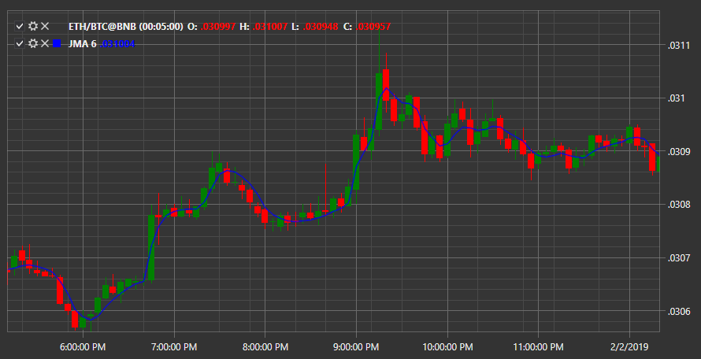

# JMA

**Jurik移動平均 (JMA)** は、移動平均の一種であるインジケーターです。このインジケーターの曲線は、優れた平滑化に加え、価格変動の終了後の最小限の先行時間と、強い価格変動に対する最小限の遅延を特徴とします。

このインジケーターを使用するには、[JurikMovingAverage](xref:StockSharp.Algo.Indicators.JurikMovingAverage) クラスを使用する必要があります。

##### インジケーター設定。

- Phase - 移動平均が展開する速度を決定します。
- Period - 移動平均の期間を決定します。

## 関連項目

[KAMA](kama.md)
