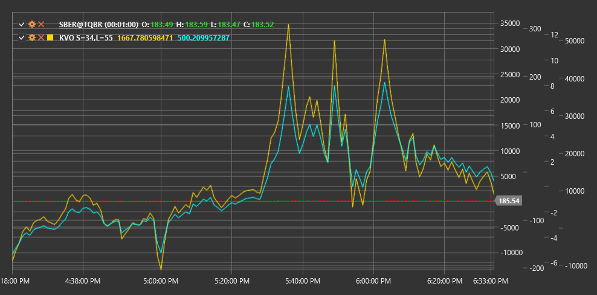

# KVO

**クリンガー出来高オシレーター (KVO)** は、市場の長期トレンドと短期反転を特定するために出来高と価格を使用する、Stephen Klinger によって開発されたテクニカルインジケーターです。

インジケーターを使用するには、[KlingerVolumeOscillator](xref:StockSharp.Algo.Indicators.KlingerVolumeOscillator) クラスを使用する必要があります。

## 説明

クリンガー出来高オシレーター (KVO) は、出来高と価格の間のダイバージェンスを測定するために Stephen Klinger によって作成されました。このインジケーターは、価格変動は出来高によって確認されるという概念に基づいています。KVO は、トレンド方向だけでなく、その強さと潜在的な反転ポイントも判断しようとします。

KVO は、価格変動の方向と大きさ、および取引量の両方を考慮する 出来高力 インジケーターを使用して、価格情報と出来高を組み合わせます。その後、このマネーフローに 2 つの異なる期間の指数移動平均（EMA）を適用し、それらの差を計算します。

このインジケーターは、ゼロラインの上下で変動するオシレーターです。正の KVO 値は買い手が市場を支配していることを示し、負の値は売り手が優位であることを示します。

## パラメーター

このインジケーターには、次のパラメーターがあります。
- **ShortPeriod** - 短期 EMA を計算する期間（デフォルト値: 34）
- **LongPeriod** - 長期 EMA を計算する期間（デフォルト値: 55）

## 計算

クリンガー出来高オシレーター の計算には、いくつかの手順があります。

1. 各期間のトレンドを決定します。
   ```
   Trend = +1, 条件: (High + Low + Close) > (High[previous] + Low[previous] + Close[previous])
   Trend = -1, それ以外の場合
   ```

2. 出来高力 インジケーターを計算します。
   ```
   出来高力 = Volume * Trend * abs(2 * ((Close - Low) - (High - Close)) / (High - Low))
   ```
   (High - Low) がゼロの場合、出来高力 は出来高にトレンドを掛けた値に設定されます。

3. 2 つの期間について EMA を計算します。
   ```
   短期EMA = EMA(ボリュームフォース, ShortPeriod)
   長期EMA = EMA(ボリュームフォース, LongPeriod)
   ```

4. 最終的な KVO を計算します。
   ```
   KVO = 短期EMA - 長期EMA
   ```

5. シグナルラインを計算します（任意）。
   ```
   シグナルライン = EMA(KVO, 13)
   ```

ここで:
- High, Low, Close - 高値、安値、終値
- Volume - 取引量
- EMA - 指数移動平均
- ShortPeriod - 短期 EMA の期間
- LongPeriod - 長期 EMA の期間

## 解釈

クリンガー出来高オシレーター は、次のように解釈できます。

1. **ゼロラインのクロスオーバー**:
   - KVO がゼロラインを下から上へクロスする場合、強気シグナルと見なすことができます
   - KVO がゼロラインを上から下へクロスする場合、弱気シグナルと見なすことができます

2. **シグナルラインのクロスオーバー**:
   - KVO がシグナルラインを下から上へクロスする場合、強気のエントリーシグナルと見なすことができます
   - KVO がシグナルラインを上から下へクロスする場合、弱気のエントリーシグナルと見なすことができます

3. **ダイバージェンス**:
   - 強気ダイバージェンス: 価格が新たな安値を形成する一方で、KVO はより高い安値を形成します
   - 弱気ダイバージェンス: 価格が新たな高値を形成する一方で、KVO はより低い高値を形成します

4. **トレンド確認**:
   - 正の KVO 値は上昇トレンドを確認します
   - 負の KVO 値は下降トレンドを確認します

5. **トレンドの強さ**:
   - KVO 値の増加（正負のいずれの場合も）は、現在のトレンドの強化を示します
   - KVO 値の低下は、現在のトレンドの弱化を示します

6. **潜在的な反転**:
   - 極端な KVO 値は、市場の買われすぎまたは売られすぎ状態と潜在的な反転を示す場合があります
   - KVO の上昇または下落の鈍化は、トレンド反転に先行する場合があります

7. **出来高と価格**:
   - KVO により、価格と出来高の動きの整合性を評価できます
   - トレンド方向の強い出来高は、より極端な KVO 値につながります



## 関連項目

[OBV](on_balance_volume.md)
[ChaikinMoneyFlow](chaikin_money_flow.md)
[ADL](accumulation_distribution_line.md)
[ForceIndex](force_index.md)
