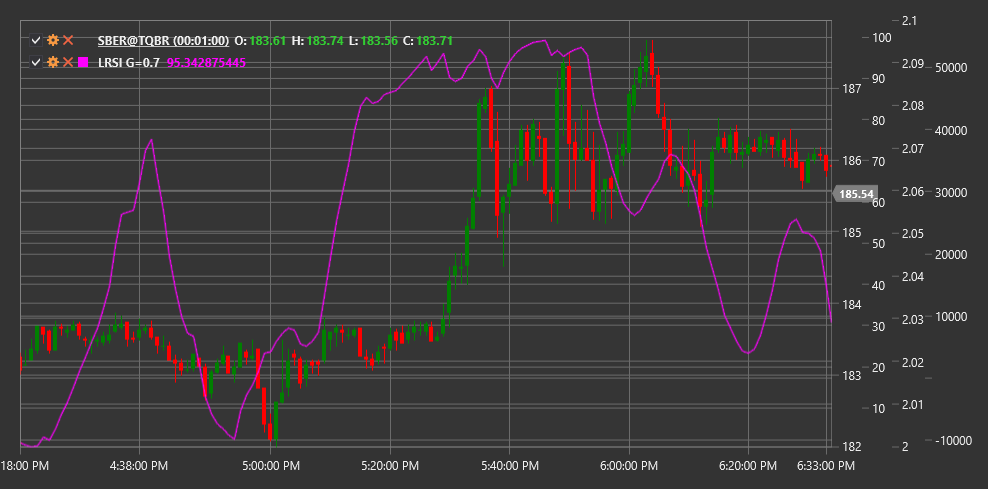

# LRSI

**ラゲール RSI (LRSI)** は、従来の 相対力指数 (RSI) の高度なバージョンとして John Ehlers によって開発された、Laguerre フィルターの数学的原理に基づくテクニカルインジケーターです。

インジケーターを使用するには、[LaguerreRSI](xref:StockSharp.Algo.Indicators.LaguerreRSI) クラスを使用する必要があります。

## 説明

ラゲール RSI (LRSI) は、従来の RSI と比較して、より感度が高く遅延の少ないインジケーターを作成するために、Laguerre フィルター数学を使用する革新的なオシレーターです。John Ehlers は、多くのテクニカルインジケーターに固有のシグナル遅延問題に対処するために、このインジケーターを開発しました。

LRSI は、Laguerre 多項式の原理と 相対力指数 の概念を組み合わせます。これにより、インジケーターはトレンド変化により素早く反応し、より明確な取引シグナルを形成できます。従来の RSI と同様に、LRSI は 0 から 1 の間（または 100 を掛けた場合は 0 から 100）で振動しますが、ノイズが少なく、より明瞭な転換を持つ構造になっています。

LRSI の主な利点は、シグナルの安定性を維持しながらトレンド変化を素早く特定できることです。これにより、短期取引やエントリーポイントとエグジットポイントの判断に特に有用です。

## パラメーター

このインジケーターには、次のパラメーターがあります。
- **ガンマ** - フィルタリング係数（デフォルト値: 0.4、範囲は 0.1 から 0.9）

Gamma パラメーターはフィルタリングの程度を決定し、インジケーターの感度に影響します。Gamma 値が低いほど、インジケーターはより滑らかで感度が低くなり、値が高いほど価格変化に対してより敏感になりますが、ノイズが増える可能性があります。

## 計算

ラゲール RSI の計算には、いくつかの手順があります。

1. 初回実行時に 4 つの Laguerre フィルター値（L0, L1, L2, L3）を初期化します。
   ```
   L0 = L1 = L2 = L3 = 0
   ```

2. 新しい価格ごとにフィルター値を更新します。
   ```
   L0_new = (1 - Gamma) * Price + Gamma * L0_old
   L1_new = -Gamma * L0_new + L0_old + Gamma * L1_old
   L2_new = -Gamma * L1_new + L1_old + Gamma * L2_old
   L3_new = -Gamma * L2_new + L2_old + Gamma * L3_old
   ```

3. フィルター済み値の「累積乗算」を計算します。
   ```
   CU = (L0_new + L1_new + L2_new + L3_new) / 4
   ```

4. 「上昇」と「下降」の構成要素に分離します。
   ```
   CU >= CU_old の場合:
     UP = CU - CU_old
     DN = 0
   Otherwise:
     UP = 0
     DN = CU_old - CU
   ```

5. 最終的な LRSI を計算します。
   ```
   LRSI = UP / (UP + DN)
   ```

   (UP + DN) がゼロの場合、LRSI は前回の値に設定されます。

ここで:
- Price - 入力価格（通常は終値）
- Gamma - フィルタリングパラメーター
- CU - 「累積乗算」

## 解釈

ラゲール RSI は従来の RSI と同様に解釈されますが、感度が高くなっています。

1. **買われすぎおよび売られすぎレベル**:
   - 0.8（または 80）を超える値は、通常、買われすぎと見なされます
   - 0.2（または 20）未満の値は、通常、売られすぎと見なされます
   - Laguerre フィルターの特性により、これらのレベルは市場ボラティリティに基づいて調整される場合があります

2. **中心線のクロスオーバー**:
   - 0.5（または 50）レベルを下から上へクロスする場合、強気シグナルと見なすことができます
   - 0.5（または 50）レベルを上から下へクロスする場合、弱気シグナルと見なすことができます

3. **ダイバージェンス**:
   - 強気ダイバージェンス: 価格が新たな安値を形成する一方で、LRSI はより高い安値を形成します
   - 弱気ダイバージェンス: 価格が新たな高値を形成する一方で、LRSI はより低い高値を形成します

4. **極端値からの反発**:
   - 買われすぎまたは売られすぎレベルからの LRSI の反転は、市場エントリーシグナルとして機能する場合があります

5. **トレンド確認**:
   - 0.5 を超える LRSI 値は上昇トレンドを確認します
   - 0.5 未満の LRSI 値は下降トレンドを確認します

6. **Gamma パラメーターの調整**:
   - より速いシグナルには、Gamma を増やします（0.9 に近づける）
   - より滑らかなシグナルには、Gamma を減らします（0.1 に近づける）



## 関連項目

[RSI](rsi.md)
[AdaptiveLaguerreFilter](adaptive_laguerre_filter.md)
[ConnorsRSI](connors_rsi.md)

