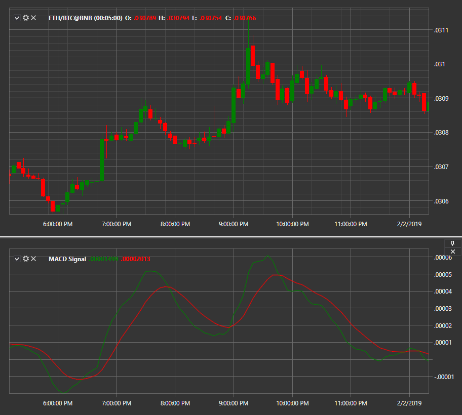

# シグナルライン付き MACD

**移動平均収束拡散 (MACD)** は、証券価格の 2 つの移動平均の関係をシグナルライン付きで表示するモメンタムインジケーターです。

インジケーター計算の詳細な説明については、[MACD ヒストグラム](macd_histogram.md) を参照してください。

このインジケーターを使用するには、[MovingAverageConvergenceDivergenceSignal](xref:StockSharp.Algo.Indicators.MovingAverageConvergenceDivergenceSignal) クラスを使用する必要があります。

## 関連項目

[NRTR](nrtr.md)
