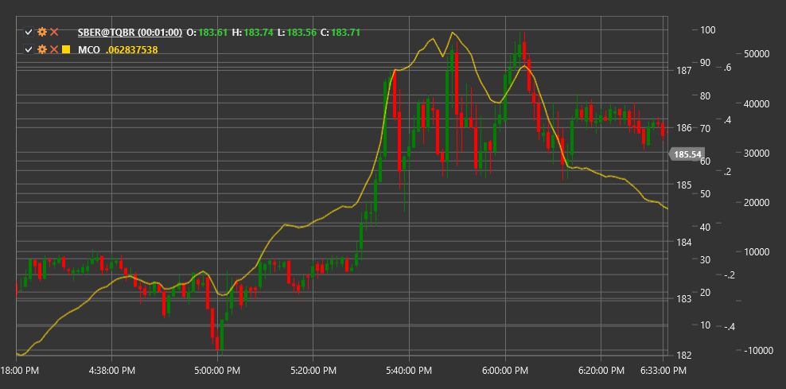

# MCO

**McClellan Oscillator (MCO)** は、値上がり銘柄と値下がり銘柄の移動平均の差を分析することで市場の広がりを測定する、Sherman McClellan と Marian McClellan によって開発されたテクニカル指標です。

この指標を使用するには、[McClellanOscillator](xref:StockSharp.Algo.Indicators.McClellanOscillator) クラスを使用する必要があります。

## 説明

McClellan Oscillator (MCO) は、市場全体の状態を評価し、潜在的な反転ポイントを特定するのに役立つ、最もよく知られた市場の広がり指標の 1 つです。1969 年に開発されて以来、多くのテクニカルアナリストにとって重要なツールとなっています。

MCO は、市場における上昇銘柄数と下落銘柄数の比率の分析に基づいています。この指標は、Net Advances（上昇銘柄数と下落銘柄数の差）の 19 期間および 39 期間の指数移動平均の差を計算します。

McClellan Oscillator は、特に次の用途に有用です。
- 市場全体の方向を判断する
- 買われ過ぎおよび売られ過ぎの状態を特定する
- 潜在的な反転ポイントを特定する
- 現在のトレンドの強さまたは弱さを確認する

## 計算

McClellan Oscillator の計算には、次の手順が含まれます。

1. 各取引日の Net Advances を計算します。
   ```
   Net Advances = Advances - Declines
   ```
   ここで、Advances は上昇銘柄数、Declines は下落銘柄数です。

2. Net Advances の 19 期間指数移動平均を計算します。
   ```
   EMA19 = EMA(Net Advances, 19)
   ```

3. Net Advances の 39 期間指数移動平均を計算します。
   ```
   EMA39 = EMA(Net Advances, 39)
   ```

4. これら 2 つの EMA の差として McClellan Oscillator を計算します。
   ```
   MCO = EMA19 - EMA39
   ```

## 解釈

McClellan Oscillator は次のように解釈できます。

1. **ゼロラインのクロスオーバー**:
   - MCO がゼロラインを下から上へクロスすると、潜在的な上昇トレンドの開始を示す強気シグナルと見なすことができます
   - MCO がゼロラインを上から下へクロスすると、潜在的な下降トレンドの開始を示す弱気シグナルと見なすことができます

2. **極端な値**:
   - +100 を超える値は、市場の買われ過ぎ状態を示すことがよくあります
   - -100 未満の値は、市場の売られ過ぎ状態を示すことがよくあります
   - 極端な値（+150/-150 以上/以下）は、潜在的な市場反転を示す可能性があります

3. **ダイバージェンス**:
   - 強気ダイバージェンス: 指数が新安値を形成する一方で、MCO はより高い安値を形成します
   - 弱気ダイバージェンス: 指数が新高値を形成する一方で、MCO はより低い高値を形成します

4. **市場の広がりの状態**:
   - 正の MCO 値は、市場内の大半の銘柄が上昇していることを示します
   - 負の MCO 値は、市場内の大半の銘柄が下落していることを示します

5. **動きの加速/減速**:
   - MCO 値の増加（正または負）は、現在の市場の動きが加速していることを示します
   - MCO 値の低下は、現在の市場の動きが減速していることを示します

6. **McClellan Summation Index との組み合わせ**:
   - McClellan Summation Index (MSI) は、MCO 値の累積合計です
   - MSI のゼロクロスは MCO シグナルを確認し、長期トレンドの変化を示すことがあります

7. **強気/弱気パターン**:
   - "強気のテール" - MCO が急落した後すばやく回復するパターンで、市場の底の可能性を示すことがよくあります
   - "弱気のテール" - MCO が急上昇した後すばやく下落するパターンで、市場の天井の可能性を示すことがよくあります



## 関連項目

[HighLowIndex](high_low_index.md)
