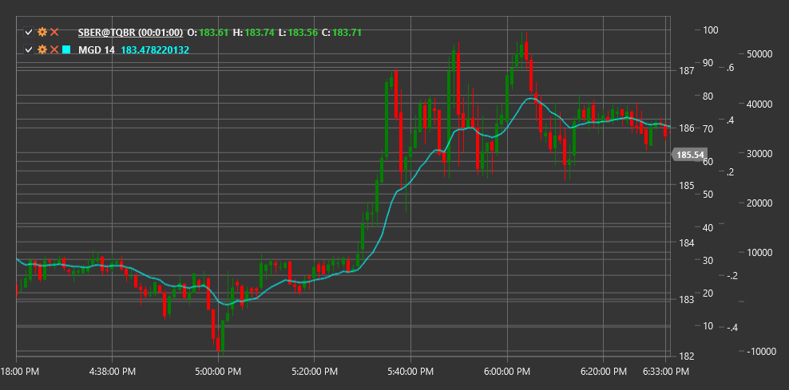

# MGD

**McGinley Dynamic (MGD)** は、市場速度の変化に基づいて速度を自動調整する高度な移動平均の一形態を表す、John R. McGinley によって開発されたテクニカル指標です。

この指標を使用するには、[McGinleyDynamic](xref:StockSharp.Algo.Indicators.McGinleyDynamic) クラスを使用する必要があります。

## 説明

McGinley Dynamic (MGD) は、遅行や市場速度の変化に適応できないといった従来の移動平均の欠点を克服するために、John McGinley によって作成されました。この指標は、価格変動速度に応じて反応期間を自動的に調整するため、急速な変化に対してより敏感で、ダマシのシグナルが発生しにくくなります。

単純移動平均や指数移動平均とは異なり、MGD は調整定数と、価格を前回の指標値で割った比率を組み込みます。これにより、MGD は緩やかな動きの間は安定性を維持しながら、大きな価格変化にはより迅速に反応できます。

主な考え方は、MGD が急速な市場の動きの間には「加速」し、保ち合い期間には「減速」することで、従来の移動平均と比較してより正確な価格追跡を提供するというものです。

## パラメーター

この指標には次のパラメーターがあります。
- **Length** - 計算期間（デフォルト値: 14）

## 計算

McGinley Dynamic の計算は、次の式を使用して再帰的に実行されます。

```
MGD = MGD[previous] + (Price - MGD[previous]) / (Length * ((Price / MGD[previous])^4))
```

ここで:
- Price - 現在価格（通常は終値）
- MGD[previous] - 前回の指標値
- Length - 期間パラメーター

初期 MGD 値には、通常、指定期間の単純移動平均が使用されます。

```
For first calculation: MGD = SMA(Price, Length)
```

## 解釈

McGinley Dynamic は、他の移動平均と同様に解釈できますが、改善された特性を備えています。

1. **トレンド判定**:
   - 価格が MGD を上回っている場合、上昇トレンドを示します
   - 価格が MGD を下回っている場合、下降トレンドを示します
   - MGD の傾きが急である場合、強いトレンドを示します

2. **価格クロスオーバー**:
   - 価格が MGD を下から上へクロスすると、強気シグナルと見なすことができます
   - 価格が MGD を上から下へクロスすると、弱気シグナルと見なすことができます
   - 適応型の性質により、これらのクロスオーバーは通常、従来の移動平均より早く形成されます

3. **複数の MGD クロスオーバー**:
   - 異なる期間の複数の MGD を使用できます（例: MGD(14) と MGD(30)）
   - 短期 MGD が長期 MGD を下から上へクロスすると、強気トレンドの確認と見なすことができます
   - 短期 MGD が長期 MGD を上から下へクロスすると、弱気トレンドの確認と見なすことができます

4. **サポートおよびレジスタンス水準**:
   - MGD は上昇トレンドで動的なサポート水準として機能することがよくあります
   - MGD は下降トレンドで動的なレジスタンス水準として機能することがよくあります
   - MGD からの複数回の反発は、トレンドの強さを確認します

5. **価格との関係**:
   - 価格と MGD の距離は、市場の買われ過ぎまたは売られ過ぎ状態を示すことがあります
   - 価格が MGD から大きく乖離している場合、潜在的な反転または調整を示す可能性があります

6. **他の指標との組み合わせ**:
   - MGD はオシレーター (RSI, Stochastic) と相性が良いです
   - 他の取引システムのトレンドフィルターとして使用できます

7. **Length パラメーターの選択**:
   - 小さい Length 値（例: 8-12）は MGD を価格変化に対してより敏感にし、短期取引に適しています
   - 大きい Length 値（例: 20-50）は MGD をより滑らかにし、長期取引に適しています



## 関連項目

[SMA](sma.md)
[EMA](ema.md)
[DEMA](dema.md)
[HMA](hma.md)
