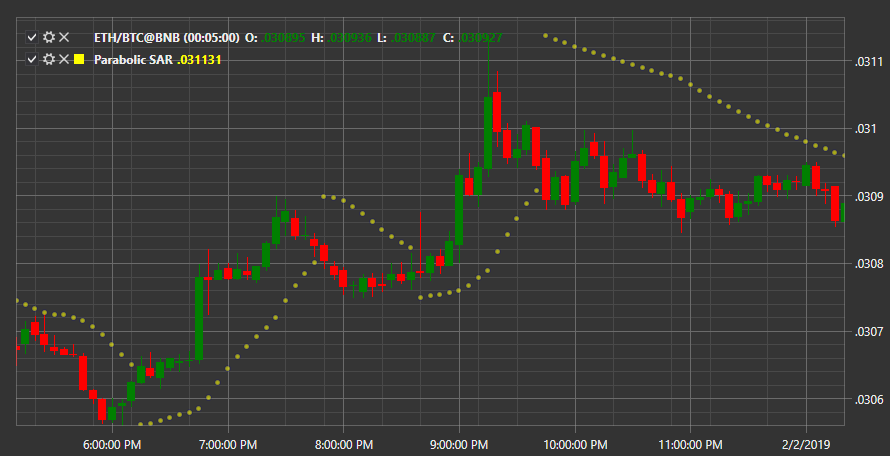

# パラボリック SAR

**パラボリック SAR (SAR)** - 価格のストップおよび反転ポイントと、トレンド方向を示すトレンドインジケーターです。

このインジケーターを使用するには、[ParabolicSar](xref:StockSharp.Algo.Indicators.ParabolicSar) クラスを使用する必要があります。
##### インジケーターの計算

次の期間（ローソク足）のインジケーターポイント（SAR）の価格は、以下の式で計算されます。

SAR(n+1) = SAR(n) + a * (high — SAR(n))、上昇トレンドの場合。
SAR(n+1) = SAR(n) + a * (low — SAR(n))、下降トレンドの場合。ここで:

SAR(n+1) — 期間 n+1 の価格。
SAR(n) — 期間 n の価格。
high と low — それぞれ新しい最大値と最小値（極値）。これらは、前回のインジケーターシグナルの発生から現在までの時間間隔で考慮されます。

a — 加速係数。

加速係数は浮動係数であり、最小値、最大値、および変化ステップによって特徴付けられます。

この係数は反転ポイントで 1 ステップに等しい最小値を取り、価格がトレンド方向の新しい極値（high または low）に達すると、係数は 1 ステップ増加します。係数が最大値に達すると、その増加は停止します。

## 関連項目

[ピーク](peak.md)
