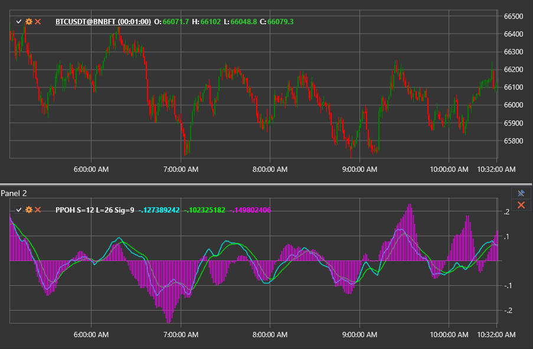

# PPO ヒストグラム

**PPO ヒストグラム (PPOH)** は、PPO ラインとそのシグナルラインの距離をヒストグラムとして表示し、トレーダーがモメンタムのバランスを即座に評価できるようにします。

このインジケーターを使用するには、[PercentagePriceOscillatorHistogram](xref:StockSharp.Algo.Indicators.PercentagePriceOscillatorHistogram) クラスを使用します。

## 説明

PPO ヒストグラムは、標準の PPO から派生したものです。PPO ラインとシグナルラインの両方を描画する代わりに、その差をゼロ水準の周囲のバーとして可視化します。正のバーは PPO ラインがシグナルラインを上回っていること（強気モメンタム）を示し、負のバーは PPO ラインがシグナルラインを下回っていること（弱気モメンタム）を示します。

ヒストグラムは PPO とシグナルラインのスプレッドの変化に素早く反応するため、トレンドの強さの早期変化を見つけたり、モメンタムのダイバージェンスを特定したりするのに適しています。

## 計算

1. 目的の期間を使用して、PPO ラインとそのシグナルラインを計算します。
2. PPO ラインからシグナルラインを差し引き、ヒストグラム値を取得します。

```
Histogram = PPO - Signal
```

ゼロを上回る値は強気圧力を強調し、ゼロを下回る値は弱気圧力を反映します。ヒストグラムバーが拡大または縮小する速度は、モメンタムの加速または減速に関する手掛かりを提供します。

## 解釈

- **ゼロラインのクロスオーバー。** ゼロを上回る動きは、PPO ラインがシグナルラインを上抜けたことを確認し、強気への変化を示唆します。ゼロを下回る動きは、弱気のクロスオーバーを示します。
- **モメンタムの急増。** 正のバーが急速に伸びる場合、強気モメンタムの強化を示唆します。バーの縮小は、強さの低下と反転の可能性を示唆します。
- **ダイバージェンス。** 価格動向とヒストグラムのダイバージェンスは、価格チャート上で明確になる前に、潜在的なトレンドの消耗をトレーダーに警告することがあります。



## 関連項目

- [PPO](percentage_price_oscillator.md)
- [PPO シグナル](percentage_price_oscillator_signal.md)
