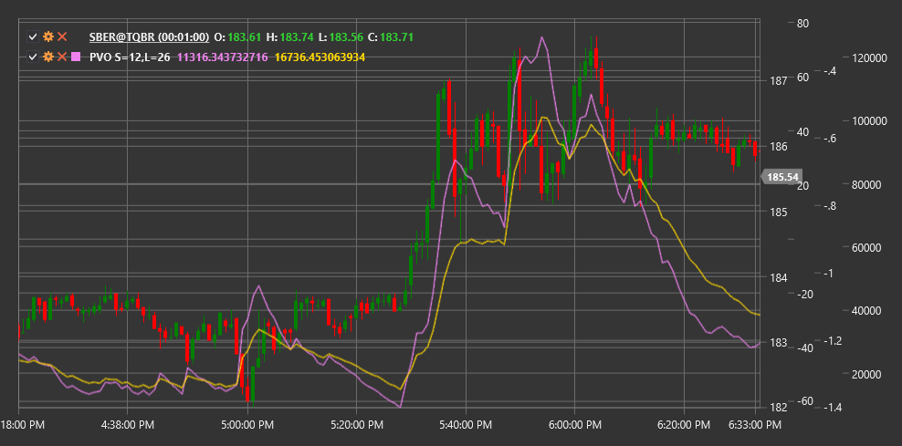

# PVO

**パーセンテージ・ボリューム・オシレーター (PVO)** は MACD に似たテクニカルインジケーターですが、価格ではなく取引量に適用され、取引量の高速および低速の指数移動平均の差をパーセンテージで表します。

このインジケーターを使用するには、[PercentageVolumeOscillator](xref:StockSharp.Algo.Indicators.PercentageVolumeOscillator) クラスを使用する必要があります。

## 説明

パーセンテージ・ボリューム・オシレーター (PVO) は、価格ではなく取引量に適用される MACD (移動平均収束拡散法) インジケーターの修正版です。PPO (パーセンテージ価格オシレーター) と同様に、PVO は高速および低速の指数移動平均の差を絶対単位ではなくパーセンテージで表します。これにより、取引量水準の異なる複数の銘柄を比較する場合や、単一の銘柄を長期間にわたって分析する場合に、PVO は特に有用です。

PVO は 3 つの構成要素で構成されます。
1. **PVO ライン** - 高速および低速の取引量 EMA のパーセンテージ差
2. **シグナルライン** - PVO ラインの EMA
3. **ヒストグラム** - PVO ラインとシグナルラインの差

PVO インジケーターは、大きな価格変動に先行する可能性がある取引量の異常を特定するのに役立ちます。また、価格トレンドの確認や潜在的な反転ポイントの特定にも有用です。

## パラメーター

このインジケーターには、次のパラメーターがあります。
- **ShortPeriod** - 短期取引量 EMA を計算する期間（既定値: 12）
- **LongPeriod** - 長期取引量 EMA を計算する期間（既定値: 26）

## 計算

パーセンテージ・ボリューム・オシレーターの計算は、次の手順で行います。

1. 取引量の短期および長期の指数移動平均を計算します。
   ```
   短期EMA = EMA(出来高, ShortPeriod)
   長期EMA = EMA(出来高, LongPeriod)
   ```

2. 短期 EMA と長期 EMA のパーセンテージ差として PVO ラインを計算します。
   ```
   PVOライン = ((短期EMA - 長期EMA) / 長期EMA) * 100
   ```

3. シグナルライン（通常は PVO ラインの 9 期間 EMA）を計算します。
   ```
   シグナルライン = EMA(PVOライン, 9)
   ```

4. ヒストグラムを計算します。
   ```
   ヒストグラム = PVOライン - シグナルライン
   ```

ここで:
- Volume - 取引量
- EMA - 指数移動平均
- ShortPeriod - 短期 EMA の期間
- LongPeriod - 長期 EMA の期間

## 解釈

パーセンテージ・ボリューム・オシレーターは、次のように解釈できます。

1. **ゼロラインのクロスオーバー**:
   - PVO ラインがゼロラインを下から上へ交差する場合、取引量が平均を上回って加速していることを示し、強気の動きを予告する可能性があります
   - PVO ラインがゼロラインを上から下へ交差する場合、取引量が平均を下回って減速していることを示し、弱気の動きを予告する可能性があります

2. **シグナルラインのクロスオーバー**:
   - PVO ラインがシグナルラインを下から上へ交差する場合、強気シグナルと見なせます
   - PVO ラインがシグナルラインを上から下へ交差する場合、弱気シグナルと見なせます

3. **ダイバージェンス**:
   - 強気ダイバージェンス: 価格が新しい安値を形成する一方で、PVO はより高い安値を形成します
   - 弱気ダイバージェンス: 価格が新しい高値を形成する一方で、PVO はより低い高値を形成します

4. **極端な値**:
   - 非常に高い PVO 値は過剰な取引量を示す場合があり、多くの場合、市場の天井やパニック時に発生します
   - 非常に低い PVO 値は不十分な取引量を示す場合があり、多くの場合、市場の停滞期に発生します

5. **ヒストグラム分析**:
   - 正のヒストグラムが増加する場合、強気の取引量モメンタムが強まっていることを示します
   - 負のヒストグラムが増加する場合、弱気の取引量モメンタムが強まっていることを示します
   - ヒストグラムの縮小は、現在の取引量モメンタムが弱まっていることを示します

6. **価格トレンドの確認**:
   - PVO の上昇は、価格の上昇トレンドを確認します
   - PVO の下落は、価格の下降トレンドを確認します
   - PVO の方向と価格のダイバージェンスは、潜在的な反転を示唆する場合があります

7. **取引量スパイク**:
   - PVO の急上昇は重要な取引量の変化を示し、多くの場合、重要な市場イベントを伴います
   - そのようなスパイクは、主要な価格水準のブレイクアウトに先行または同時発生する場合があります



## 関連項目

[PPO](percentage_price_oscillator.md)
[OBV](on_balance_volume.md)
[MACD](macd.md)
[ChaikinMoneyFlow](chaikin_money_flow.md)
