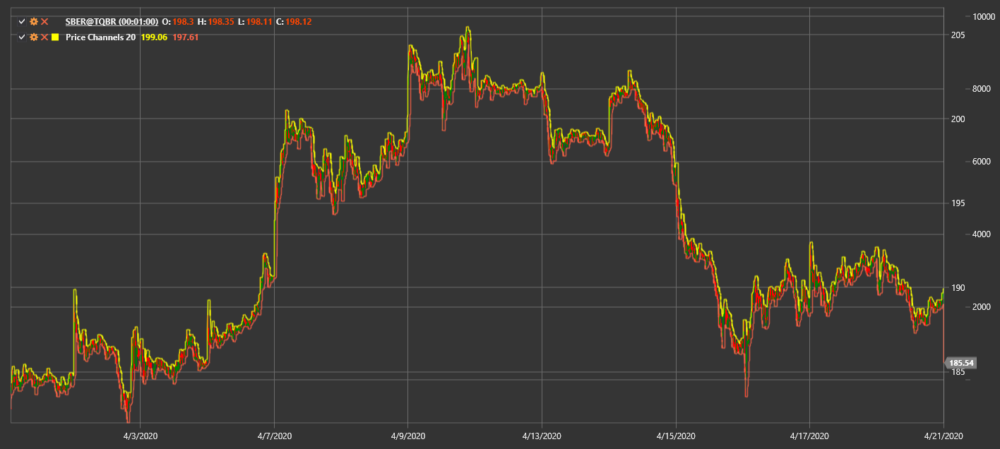

# 価格チャネル

**価格チャネル (PC)** は、指定期間における価格変動の上限と下限を表示します。

このインジケーターを使用するには、[PriceChannels](xref:StockSharp.Algo.Indicators.PriceChannels) クラスを使用する必要があります。

## 推奨コンテンツ

[ドンチャンチャネル](donchian_channels.md)
