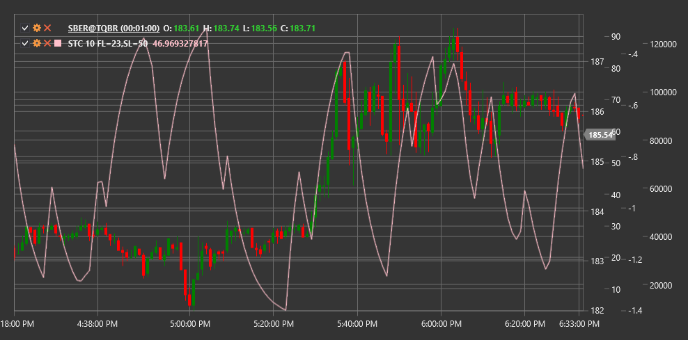

# STC

**シャフ・トレンドサイクル (STC)** は、Doug Schaff によって開発されたモメンタム指標です。STC は、市場サイクルが真のトレンドよりも、買われ過ぎと売られ過ぎの状態の間をより頻繁に移動するという前提に基づいています。

この指標を使用するには、[SchaffTrendCycle](xref:StockSharp.Algo.Indicators.SchaffTrendCycle) クラスを使用する必要があります。

## 説明

シャフ・トレンドサイクル は、ストキャスティクスオシレーター、MACD、サイクル分析の利点を組み合わせたものです。この指標は、MACD や ストキャスティクス などの従来の指標よりもトレンド変化に素早く反応できます。

STC は 0 から 100 の間で振動します。
- 75 を上回る値は通常、買われ過ぎの状態を示します
- 25 を下回る値は、売られ過ぎの状態を示します
- 50 水準をクロスすると、トレンド変化を示す場合があります

主な指標シグナル:
- STC が 25 水準を下から上にクロスしたときに買い（売られ過ぎゾーンからの脱出）
- STC が 75 水準を上から下にクロスしたときに売り（買われ過ぎゾーンからの脱出）

## パラメーター

- **期間** - 指標を計算するための主期間。

## 計算

STC の計算は複数のステップで実行されます。

1. MACD を計算します。
   ```
   MACD = EMA(Close, Fast) - EMA(Close, Slow)
   Signal = EMA(MACD, Signal)
   ```
   ここで Fast、Slow、Signal は通常、それぞれ 23、50、10 です。

2. MACD に基づいて ストキャスティクスオシレーター を計算します。
   ```
   Stoch_K = 100 * ((MACD - Lowest(MACD, Length)) / (Highest(MACD, Length) - Lowest(MACD, Length)))
   Stoch_D = EMA(Stoch_K, 3)
   ```

3. STC を得るためにストキャスティクス計算を繰り返します。
   ```
   STC = 100 * ((Stoch_D - Lowest(Stoch_D, Length)) / (Highest(Stoch_D, Length) - Lowest(Stoch_D, Length)))
   ```

その結果、古典的な ストキャスティクス よりも滑らかで、MACD よりもトレンド変化に素早く反応するオシレーターになります。



## 関連項目

[MACD](macd.md)
[ストキャスティクス](stochastic_oscillator.md)
