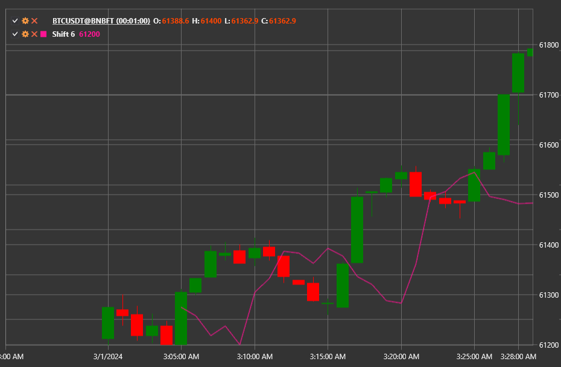

# Shift

**Shift** は、入力される値のストリームを指定された期間数だけオフセットする補助指標です。データを変換するものではなく、複合計算で使用するために遅延または整列させるだけです。

この指標にアクセスするには、[Shift](xref:StockSharp.Algo.Indicators.Shift) クラスを使用します。

## 説明

この指標は最新値のバッファを保持し、**Length** 本前に到着した値を出力します。データ履歴が必要なオフセットより短い場合、その値は未定義と見なされます。

## パラメーター

- **Length** — データをシフトする期間数。

## 使用法

- 異なる指標からのシグナルを時間的に整列させます。
- 遅延入力を必要とするカスタム指標やストラテジーを構築します。
- たとえば、現在価格と過去値の差を計算するために、合成系列を作成します。

## 関連項目

[PassThrough](pass_through.md)
[Sum](sum_n.md)

