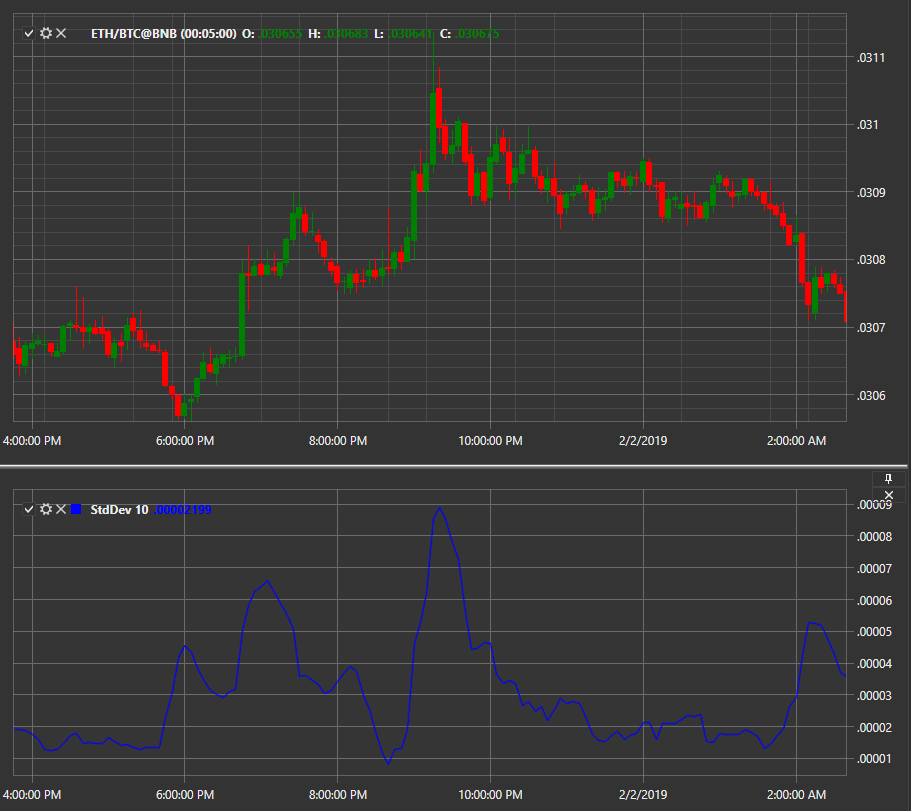

# 標準偏差

**標準偏差** は、証券価格の範囲を示し、そのボラティリティを特徴づけるインジケーターです。通常、インジケーターの値は分析対象資産の価格単位で表されます。標準偏差は標準価格偏差の関数であり、数理統計で広く使用されています。

このインジケーターを使用するには、[StandardDeviation](xref:StockSharp.Algo.Indicators.StandardDeviation) クラスを使用する必要があります。

## 推奨コンテンツ

[ストキャスティクスオシレーター](stochastic_oscillator.md)
