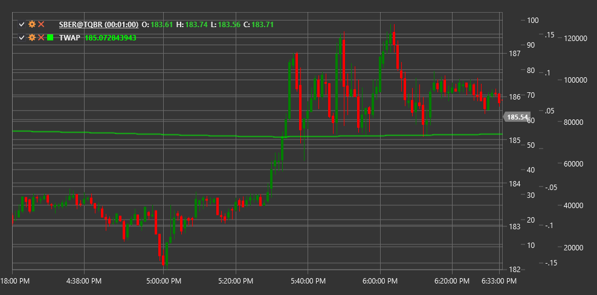

# TWAP

**時間加重平均価格 (TWAP)** は、特定の期間にわたり、時間で加重した金融商品の平均価格を計算するインジケーターです。TWAP は、市場への影響を最小限に抑えて大口注文を執行するために、機関投資家によって広く使用されています。

このインジケーターを使用するには、[TimeWeightedAveragePrice](xref:StockSharp.Algo.Indicators.TimeWeightedAveragePrice) クラスを使用する必要があります。

## 説明

TWAP は、大口注文を時間全体に均等に分散された一連の小口注文へ分割する、最も一般的な注文執行アルゴリズムの 1 つです。TWAP の目的は、市場への影響を最小限に抑えながら、特定の時間間隔にわたる平均価格を得ることです。

TWAP の主な用途:
- 注文執行品質を評価するためのベンチマーク価格
- 市場への影響を最小限に抑えるための執行アルゴリズム
- 市場分析と取引意思決定のためのツール

VWAP (出来高加重平均価格) とは異なり、TWAP は取引量を考慮せず、時間の側面のみに焦点を当てます。

## 計算

TWAP の計算は、等間隔の時点における価格を合計し、その合計を時間間隔の数で割ることによって行われます。

```
TWAP = (P1 + P2 + P3 + ... + Pn) / n
```

ここで:
- P1, P2, ..., Pn - 連続する各時点の価格
- n - 時間間隔の数

実際の実装では、各期間 (ローソク足) の代表価格が最もよく使用されます。

```
Typical Price = (High + Low + Close) / 3
TWAP = Sum(Typical Price) / 期間数
```

現在の TWAP 値をリアルタイムで求めるために、再帰式を使用することもできます。

```
TWAP(current) = (TWAP(previous) * (n-1) + P(current)) / n
```

ここで n は TWAP ウィンドウ内の観測数です。


