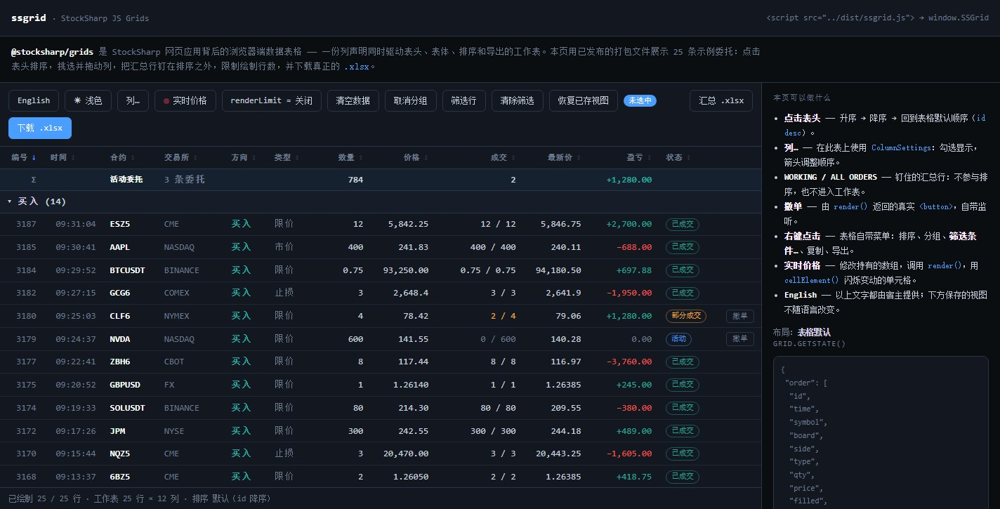

# DataGrid

`DataGrid<TRow>` は、`GridColumn<TRow>` 宣言の配列からブラウザーテーブルを構築します。1 つの宣言でヘッダー、表示値、並べ替え、フィルタリング、CSS クラス、エクスポート値を定義するため、列セットを変更しても各表現が食い違いません。

## テーブルの作成

`DataGrid` は渡された `head` と `body` を空にし、その後は内容を管理します。マークアップには両方のセクションが必要です。

```html
<table id="orders" class="orders-grid">
  <thead></thead>
  <tbody></tbody>
</table>
```

```ts
import {
  DataGrid,
  GridPinnedPlacements,
  SortDirections,
} from '@stocksharp/grids';

interface Order {
  id: number;
  symbol: string;
  side: 'buy' | 'sell';
  price: number;
  volume: number;
  board: string;
}

const table = document.querySelector<HTMLTableElement>('#orders')!;
const grid = new DataGrid<Order>({
  head: table.tHead!,
  body: table.tBodies[0],
  columns: [
    { key: 'id', header: '番号', value: order => order.id, filter: 'number', exportable: true },
    { key: 'symbol', header: '銘柄', value: order => order.symbol, filter: 'text', exportable: true },
    {
      key: 'side',
      header: '売買区分',
      value: order => order.side,
      text: order => order.side === 'buy' ? '買い' : '売り',
      render: order => order.side === 'buy' ? '買い' : '売り',
      cellClass: order => order.side === 'buy' ? 'side-buy' : 'side-sell',
      exportValue: order => order.side === 'buy' ? '買い' : '売り',
      filter: 'set',
      exportable: true,
    },
    { key: 'price', header: '価格', value: order => order.price, filter: 'number', exportable: true },
    { key: 'volume', header: '数量', value: order => order.volume, filter: 'number', exportable: true },
    { key: 'board', header: '取引ボード', value: order => order.board, filter: 'set', exportable: true },
  ],
  defaultSort: { col: 'id', dir: SortDirections.Desc },
  rowKey: order => String(order.id),
  emptyText: '注文はありません',
  locale: 'ja-JP',
  reorderable: true,
  filtersVisible: true,
  selection: 'multi',
  selectedClass: 'is-selected',
  contextMenu: true,
  pinnedRows: () => [{
    key: 'total',
    className: 'grid-total',
    place: GridPinnedPlacements.Bottom,
    cells: [
      { content: '', className: '' },
      { content: '合計', className: 'grid-total-label' },
      { content: '', className: '' },
      { content: '', className: '' },
      { content: '150', className: 'grid-total-value' },
      { content: '', className: '' },
    ],
  }],
});

const orders: Order[] = [
  { id: 101, symbol: 'SBER', side: 'buy', price: 312.45, volume: 100, board: 'TQBR' },
  { id: 102, symbol: 'GAZP', side: 'sell', price: 164.18, volume: 50, board: 'TQBR' },
];

grid.setRows(orders);
```

`rowKey` は、一意で安定したキーを返す必要があります。テーブルはそのキーを使って再描画後も選択を保持し、`rowElement()` と `cellElement()` で要素を検索します。

## 列の定義

`GridColumn<TRow>` の主なフィールドは次のとおりです。

- `key` — 列の永続的な識別子。
- `header` — ローカライズ済みのヘッダー。
- `value(row)` — 並べ替え用の値。既定では表示とエクスポートにも使用されます。
- `render(row)` — セルに使用する文字列または DOM ノード。
- `text(row)` — グループ、集合フィルター、コンテキストメニューで使用する値のテキスト表現。
- `cellClass(row)` と `bindCell(td, row)` — セルのスタイルとハンドラー。
- `filter` — フィルターの種類。`text`、`number`、`set` のいずれか。
- `exportable` と `exportValue(row)` — 列を含める指定と `.xlsx` 専用の値。

`render()` が `Node` または `DocumentFragment` を返す場合、コンポーネントは HTML 文字列ではなく DOM としてセルへ追加します。これによりボタンを安全に作成し、`addEventListener` でハンドラーを割り当てられます。

## 並べ替え、フィルター、グループ化

ヘッダーをクリックすると、「昇順 → 降順 → 既定の順序」の順に並べ替えが切り替わります。空の値はどちらの方向でも末尾に配置されます。テキストの比較には `locale` で指定した言語の `Intl.Collator` が使用され、パラメーターがない場合はドキュメントの言語が使用されます。

`filtersVisible: true` を指定すると、ヘッダーの下にクイックフィルター行が表示されます。プログラム用インターフェイスは、シリアライズ可能なオブジェクトを受け取ります。

```ts
grid.setFilter('symbol', { op: 'startsWith', text: 'SB' });
grid.setFilter('price', { op: 'between', min: 300, max: 320 });
grid.setFilter('board', { op: 'anyOf', values: ['TQBR', 'TQTF'] });

const rowsAfterFilters = grid.filteredRows();
grid.clearFilters();
```

使用できる操作は `contains`、`notContains`、`startsWith`、`endsWith`、`eq`、`ne`、`gt`、`ge`、`lt`、`le`、`between`、`anyOf`、`noneOf`、`empty`、`notEmpty` です。空のフィルターオブジェクトは、フィルターなしと同じです。

グループ化は 1 階層に対応します。グループ内の行には選択中の並べ替えが維持され、グループは折りたためます。

```ts
grid.groupBy('board');
grid.toggleGroup('TQBR');
grid.groupBy(null);
```

## コンテキストメニューとフィルターダイアログ


`contextMenu: true` の場合、組み込みの `GridContextMenu` から、並べ替え、グループ化、値によるフィルタリング、列の非表示と復元、セルまたは行のコピー、`.xlsx` へのエクスポートを実行できます。`contextMenu` オブジェクトを使用すると、CSS クラス、ラベル、操作一覧を変更できます。

```ts
contextMenu: {
  classes: { menu: 'orders-menu', item: 'orders-menu-item' },
  labels: {
    sortAsc: '昇順',
    sortDesc: '降順',
    filterRule: 'フィルターを設定…',
    filterByValue: value => `この値だけを表示: ${value}`,
  },
  items: (context, defaults) => context.row
    ? [
        {
          label: `注文番号 ${context.row.id} を取消`,
          run: () => cancelOrder(context.row!.id),
        },
        {},
        ...defaults,
      ]
    : defaults,
}
```

`labels` のフィールドは省略可能です。指定しなかったラベルには英語の既定値が残ります。完全な日本語インターフェイスにするには、アプリケーションから表示可能な `GridMenuLabels` と `GridFilterDialogLabels` のラベルをすべて渡してください。


`GridFilterDialog` はメニューから、または `openFilterDialog(key, x, y)` メソッドで開きます。クイックフィルター行とは異なり、演算子とそのオペランドを選択できます。`set` フィルターでは、実際に存在する値の一覧が表示されます。ページ上で同時に開ける組み込みダイアログとコンテキストメニューは、それぞれ 1 つだけです。

メニューとダイアログのコンポーネントはマークアップを作成し、クラス名を割り当てますが、完成済みのスタイルは提供しません。アプリケーションで標準の `grid-menu*` クラスと `grid-filter-dialog*` クラスを定義するか、`classes` を介して独自クラスを渡す必要があります。

低水準クラスもパッケージからエクスポートされます。`GridContextMenu.open(items, x, y)` は `GridMenuItem` の配列を表示します。空のオブジェクトは区切り、`disabled` は操作の無効化、`checked` は項目の選択状態を表します。`GridFilterDialog.open(options, commit)` は、`options.header` から列見出しを受け取り、さらにフィルターの種類、現在の条件、値の候補、座標を使用します。`commit` 関数は、新しい `GridFilter` を受け取り、クリア時には `null` を受け取ります。どちらのクラスにも `isOpen` プロパティと `close()` メソッドがあります。通常は手動で作成する必要はありません。`DataGrid` が `contextMenu` パラメーターと `openFilterDialog()` メソッドを介して管理します。

## 状態と行選択

`getState()` は、列の順序と非表示列、並べ替え、フィルター、グループ化、折りたたまれたグループ、ヘッダーとフィルター行の表示状態を含む、通常の JSON 互換オブジェクトを返します。

```ts
const grid = new DataGrid<Order>({
  // その他のパラメーター
  onStateChange: state => {
    localStorage.setItem('orders-grid', JSON.stringify(state));
  },
});

const saved = localStorage.getItem('orders-grid');
if (saved)
  grid.setState(JSON.parse(saved));
```

状態の復元時には不明な列キーが無視され、保存された順序にない新しい列は、列挙された列の後へ追加されます。`setState()` は `onStateChange` を呼び出さないため、読み込みによって状態が再保存されることはありません。

行選択は `GridState` に含まれません。復元する必要がある場合は、`onSelectionChange` から得たキーを別途保存し、`setSelection(keys)` に渡してください。

## リアルタイムデータとエクスポート

`setRows(rows)` は行セットを置き換え、テーブルを再描画します。コンポーネントは渡された配列への参照を保持するため、オブジェクトを変更した後に `render()` を呼び出せます。個別更新には `cellElement(rowKey, columnKey)`、行の検索には `rowElement(rowKey)` を使用します。

`renderLimit` が制限するのは DOM 内の行数だけです。フィルタリング、並べ替え、エクスポートは、引き続き全データを対象にします。`afterRender()` は 2 回目以降の各再描画後に呼び出され、たとえば現在表示中の銘柄へ再購読する用途に適しています。

`pinnedRows()` の固定行は描画のたびに再取得され、並べ替え、選択、エクスポートには参加しません。`exportData()` はファイルをダウンロードせずにヘッダーと行を返し、`download(baseName, sheetName)` は `.xlsx` を作成します。

## ローカライズとインスタンスの破棄



パッケージ自体はヘッダーや値を翻訳しません。アプリケーションから、ローカライズ済みの `header`、`emptyText`、`text`、`groupHeader`、メニューとダイアログのラベルを渡します。状態にはキーと元の値が保存されるため、言語を切り替えた後、新しいインスタンスへ移行できます。

インスタンスを置き換える前に `destroy()` を呼び出してください。このメソッドはドキュメントから `Ctrl+C` ハンドラーを削除し、開いているメニューとダイアログを閉じます。

```ts
const state = grid.getState();
grid.destroy();

const localizedGrid = createJapaneseGrid();
localizedGrid.setState(state);
```

## 関連項目

- [JavaScript テーブル](../grids.md)
- [TableSort](table_sort.md)
- [TableExport](table_export.md)
- [ColumnSettings](column_settings.md)
- [JS-Grids オンラインデモ](https://stocksharp.github.io/JS-Grids/demo/)
