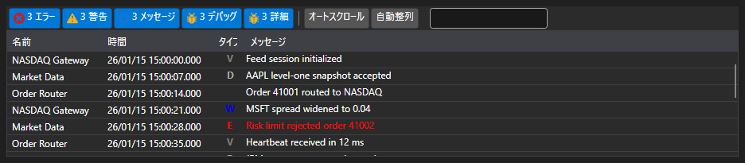

# ビジュアル監視

監視を簡略化するために、専用の [Monitor](xref:StockSharp.Xaml.Monitor) コンポーネントを使用できます。[ビジュアルログコンポーネント](../graphical_user_interface/logging.md) も参照してください。



このウィンドウでは、すべての [ILogSource](xref:Ecng.Logging.ILogSource) からのメッセージを表示できます。

- ストラテジー（[Strategy](xref:StockSharp.Algo.Strategies.Strategy)）;
- コネクター（[IConnector](xref:StockSharp.BusinessEntities.IConnector)）;
- 独自の [ILogSource](xref:Ecng.Logging.ILogSource) 実装（たとえば、アルゴリズム内のメインウィンドウ）。

ソースのネストはツリー形式で表示されます。各親ノードには、すべてのネストされたソースからのメッセージが含まれ、最下位レベルまで同様に続きます。コネクターの場合、これは [BasketTrader](../connectors.md) を使用するときにも便利です。同様に、[ILogSource.Parent](xref:Ecng.Logging.ILogSource.Parent) プロパティを実装することで、自分のアルゴリズムにも同じネストを構成できます。

## Monitor の使用

1. まず、ウィンドウを作成し、コンポーネントを追加する必要があります。
2. 次に、作成したウィンドウを [LogManager](xref:Ecng.Logging.LogManager) に [GuiLogListener](xref:StockSharp.Xaml.GuiLogListener) を通じて追加する必要があります。

   ```cs
   _logManager.Listeners.Add(new GuiLogListener(monitor));
   ```
3. 以後、すべてのソース [LogManager.Sources](xref:Ecng.Logging.LogManager.Sources)（ストラテジー、コネクターなど）は [Monitor](xref:StockSharp.Xaml.Monitor) にメッセージを送信します。

## 推奨コンテンツ

[ビジュアルログコンポーネント](../graphical_user_interface/logging.md)
