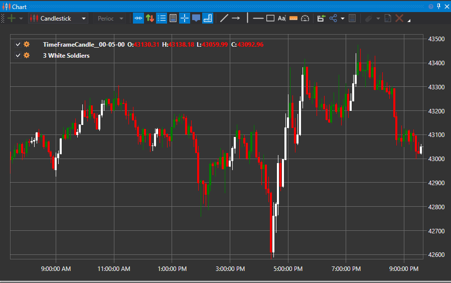

# 3 Black Crows と 3 White Soldiers パターン

### 3 Black Crows

Three Black Crows は、上昇トレンドの反転を予測できる弱気のローソク足パターンです。

3 Black Crows パターンは、前のローソク足の実体内で始まり、前のローソク足より下で終わる 3 本の連続したローソク足で構成されます。トレーダーは多くの場合、反転の確認として、このインジケーターを他のテクニカル インジケーターまたはチャート パターンと組み合わせて使用します。

##### 主な特徴:

- Three Black Crows は、現在の上昇トレンドの反転を予測するために使用される弱気のローソク足パターンです。
- トレーダーは、Relative Strength Index (RSI) などの他のテクニカル インジケーターと併用します。
- パターンのローソク足サイズとヒゲは、反転から押し戻しへ移行するリスクを示すことがあります。
- Three Black Crows の反対パターンは Three White Soldiers で、下降トレンドの反転を示します。

### 3 White Soldiers

Three White Soldiers は、価格チャート上の現在の下降トレンドの反転を予測するために使用される強気のローソク足パターンです。このパターンは、前のローソク足の実体内で始まり、前のローソク足の高値を超えて終わる 3 本の連続した長いローソク足で構成されます。これらのローソク足には非常に長いヒゲがないことが望ましく、理想的にはパターン内の前のローソク足の実体内で始まります。

##### 主な特徴

- Three White Soldiers は、Relative Strength Index (RSI) などの他のテクニカル インジケーターによって確認される場合、信頼できる反転モデルと見なされます。
- ローソク足のサイズとヒゲの長さは、押し戻しのリスクがあるかどうかを評価するために使用されます。
- Three White Soldiers の反対パターンは Three Black Crows で、上昇トレンドの反転を示します。

