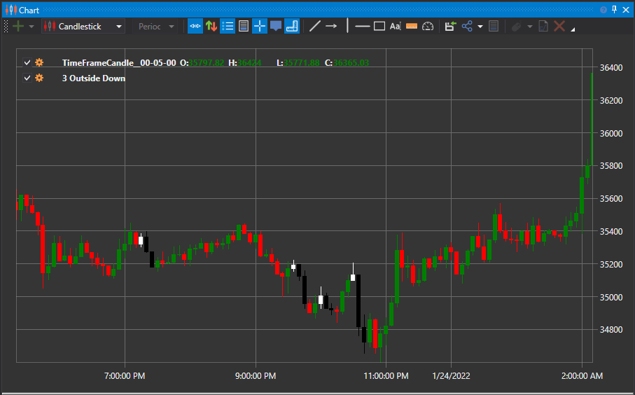

# 3 Outside Down と 3 Outside Up パターン

3 Outside Down および 3 Outside Up という用語は、3 本のローソク足からなる反転パターンを指します。パターンが形成されるには、3 本のローソク足が特定の順序で形成される必要があり、現在のトレンドが勢いを失い、既存トレンドの反転を示唆する可能性があります。具体的には、弱気のローソク足 (始値より低く終わる) の後に強気のローソク足 (始値より高く終わる) が 2 回続く場合、またはその逆の場合にパターンが形成されます。

##### 主な特徴:

- 3 Outside Down/Up パターンは、多くの場合トレンド反転を示す 3 本ローソク足パターンです。
- 3 Outside Down および 3 Outside Up パターンは、1 本のローソク足の直後に反対色のローソク足が 2 本続くことを特徴とします。
- それぞれ、市場心理を利用して短期的な地合いの変化を理解することを目的としています。

### 3 Outside Up

この強気のローソク足パターンには、次の特徴があります。

1. 市場は下降トレンドにあります。
2. 1 本目のローソク足は弱気です。
3. 2 本目のローソク足は、長い実体を持つ強気のローソク足で、1 本目のローソク足を完全に包み込みます。
4. 3 本目のローソク足は強気で、2 本目のローソク足より高い終値を付けます。

### 3 Outside Down

このパターンの変形は、次の特徴を持つ弱気のローソク足モデルです。

1. 市場は上昇トレンドにあります。
2. 1 本目のローソク足は強気です。
3. 2 本目のローソク足は、1 本目のローソク足を完全に包み込む長い実体を持つ弱気のローソク足です。
4. 3 本目のローソク足は弱気で、2 本目のローソク足より低い終値を付けます。

2 本目のローソク足が 1 本目を包み込むため、1 本目のローソク足は支配的なトレンドの終わりの始まりを示します。その後、3 本目のローソク足は反転の加速を示します。

## 関連項目

[3 Inside Down と 3 Inside Up パターン](3_inside_down_3_side_up.md)

