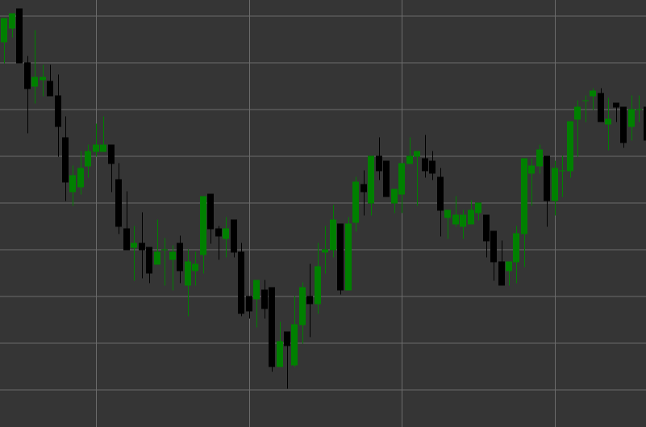

# Black Candle パターン

Black Candle（弱気ローソク足）は、終値が始値より低いときに形成される古典的なローソク足パターンです。このローソク足は、ローソク足の形成期間中に売り手が価格を支配していた、弱気の市場センチメントを反映します。

##### 主な特徴:

- 始値が終値より高い（O > C）。
- ローソク足の実体は通常、黒（または現代のチャートでは赤）で表示される。
- 買い手より売り手が優勢であることを示す。
- ローソク足の実体の大きさは、弱気の動きの強さを示す。

### 解釈

Black Candle は、市場における弱気圧力を示します。

- ローソク足の実体が長いほど、弱気圧力は強くなります。
- 上昇トレンド後の長い黒ローソク足は、反転の可能性を示す場合があります。
- 短いヒゲの存在は、その期間を通じて弱気派が価格を支配していたことを示します。
- 連続する黒ローソク足は、安定した下降トレンドを示します。

### 取引戦略

単独の黒ローソク足は通常、独立した取引シグナルではありませんが、より広い戦略の一部として使用できます。

- 上昇後の下降トレンドまたは反転の確認。
- 潜在的なショートポジションのために、レジスタンス水準で長い黒ローソク足を探す。
- 他のローソク足パターンと組み合わせて使用する。たとえば、弱気包み足の後の黒ローソク足。
- 連続する黒ローソク足の後にサポート水準を特定する。

## 関連項目

[White Candle パターン](white_candle.md)

[Black Marubozu パターン](black_marubozu.md)
