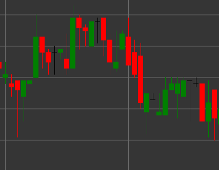

# Flat（中立）Candle パターン

Flat（中立）ローソク足は、始値と終値が同一、または非常に近い場合に形成されるローソク足パターンです。このローソク足は、買い手と売り手の力が均衡している、市場の迷いを反映します。

##### 主な特徴:

- 始値が終値に等しい（O == C）。
- 上ヒゲと下ヒゲの長さは異なる場合がある。
- 市場の中立性または迷いを示す。
- 既存トレンドの継続前の保ち合い、または反転の可能性を示す場合がある。

### 解釈

フラットなローソク足単体では、市場の方向性について明確なシグナルを提供しませんが、前のローソク足や全体的なトレンドの文脈では有用な場合があります。

- 強い上昇または下降の後では、フラットなローソク足は勢いの弱まりと反転の可能性を示す場合があります。
- 横ばいの動きの中では、フラットなローソク足は保ち合いの継続を確認します。
- ヒゲの大きさは、市場センチメントに関する追加情報を提供します。長いヒゲは価格変動の試みが拒否されたことを示し、短いヒゲは低いボラティリティを示します。

### 取引戦略

フラットなローソク足がポジションエントリーの単独シグナルとして使われることはまれですが、取引判断に役立つ場合があります。

- 取引を行う前に、後続のローソク足または他のテクニカル指標による確認を探します。
- 他の分析手法と組み合わせて、サポート水準またはレジスタンス水準を特定するためにフラットなローソク足を使用します。
- トレンド中にフラットなローソク足が現れた場合は、動きの弱まりを示す可能性があるため、ストップロス幅を広げるか利益確定を行います。

## 関連項目

[白いローソク足 パターン](white_candle.md)

[黒いローソク足 パターン](black_candle.md)
