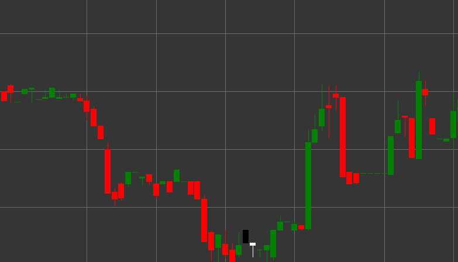

# On-Neck パターン

On-Neck は、下降トレンドで形成される、2 本のローソク足から構成される弱気のトレンド継続ローソク足パターンです。このパターンは、強気派によるトレンド反転の一時的で失敗した試みを示し、その後に下降の動きが継続します。

##### 主な特徴:

- 1 本目のローソク足は黒 (弱気) で、始値が終値より高く (O > C)、比較的長い実体を持つ。
- 2 本目のローソク足は白 (強気) で、始値が終値より低い ((C > O) && (ABS(pL - C) <= 1))。
- 2 本目のローソク足の終値は、1 本目のローソク足の安値付近 (またはその水準) にある。
- 下降トレンドで形成される。

### 解釈

On-Neck は、下降トレンド継続のシグナルと見なされます。

- 1 本目のローソク足は既存の下降トレンドを確認します。
- 2 本目のローソク足は下方向のギャップで始まり、弱気圧力の継続を示します。
- しかし、セッション中に強気派は動きを反転させようとしますが、価格を前のローソク足の安値まで押し上げることしかできません。
- 2 本目のローソク足が 1 本目のローソク足の安値の水準で引けることは、買い手がこのレジスタンス水準を克服できなかったことを示します。
- これは下降トレンドが継続する可能性を示します。

### 取引戦略

On-Neck は、ショートポジションに入る、または強化する機会を提供します。

- パターン形成後、通常は 3 本目のローソク足の始値で、ショートポジションに入るか既存のショートポジションを追加します。
- 2 本目のローソク足の高値の上、またはより保護を重視する場合は 1 本目のローソク足の高値の上にストップロスを置きます。
- 目標利益は、以前のサポート水準に基づくか、1 本目のローソク足の高さを投影するなどのテクニカルな測定方法を使用して設定できます。
- 出来高に注意します。2 本目のローソク足で出来高が減少し、その後の弱気ローソク足で増加すると、シグナルの信頼性が高まります。
- 他のインジケーターやパターンと組み合わせて、取引成功の確率を高めます。
