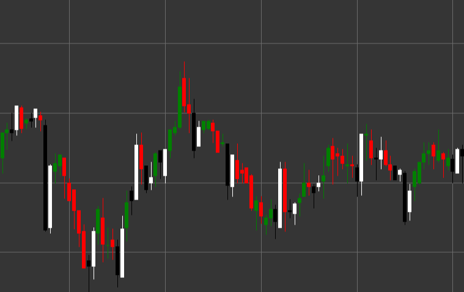

# 切り込み線 パターン

切り込み線は、下降トレンドで形成される、2 本のローソク足から構成される強気の反転ローソク足パターンです。1 本目のローソク足は黒 (弱気) で、その後に白 (強気) のローソク足が続きます。この 2 本目は前のローソク足の安値より下で始まり、前のローソク足の実体の中間点より上で引けます。

##### 主な特徴:

- 1 本目のローソク足は黒で、始値が終値より高い (O > C)。
- 2 本目のローソク足は白で、始値が終値より低い (O < C)。
- 2 本目のローソク足の終値は 1 本目のローソク足の実体に深く入り込み、1 本目のローソク足の中間点より上で引ける (C > (pB / 2 + pC))。
- 下降トレンドで形成される。

### 解釈

切り込み線は、下降トレンドの潜在的な反転を示す信頼性の高いシグナルと見なされます。

- 2 本目のローソク足が 1 本目のローソク足の安値より下で始まること (下方向ギャップ) は、弱気圧力の継続を示します。
- しかし、取引セッション中に強気派が主導権を握り、価格を大きく押し上げ、前のローソク足の実体の中間点より上で引けます。
- これは、センチメントが弱気から強気へ急激に変化したことを示します。
- 1 本目のローソク足の実体の後半部分へ深く入り込むほど、シグナルは強くなります。
- 2 本目のローソク足の終値が 1 本目のローソク足の始値より上にある場合、このパターンは「強気包み線」カテゴリへ移行し、さらに強いシグナルと見なされます。

### 取引戦略

切り込み線は、ロングポジションに入る良い機会を提供します。

- パターンを確認した後、通常は 3 本目のローソク足の始値、または 2 本目のローソク足の高値を上抜けた時点でポジションに入ります。
- 2 本目のローソク足の安値、またはパターン全体の安値の下にストップロスを置きます。
- 目標利益は、以前のレジスタンス水準または Fibonacci 水準に基づいて設定できます。
- 取引出来高を考慮します。2 本目のローソク足の形成中に出来高が高いと、シグナルの信頼性が高まります。
- RSI や Stochastic などの売られ過ぎインジケーターからの追加確認により、取引成功の確率が高まります。

## 関連項目

[強気包み線 パターン](bullish_engulfing.md)
