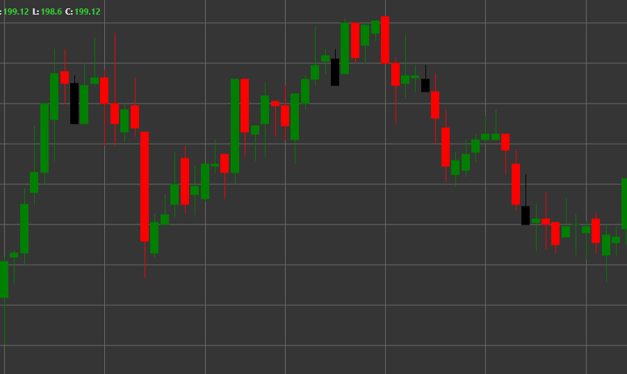

# Shooting Star パターン

Shooting Star は、上昇トレンドで形成される弱気の反転ローソク足パターンです。ローソク足は下部に小さな実体を持ち、長い上ヒゲがあり、下ヒゲはないか非常に短くなります。上向きの尾を持つ星に似ています。

##### 主な特徴:

- 始値が終値より高い (O > C)。ただし逆の場合もあります。
- 価格範囲の下部に小さなローソク足の実体がある。
- 長い上ヒゲ。通常は実体の 2-3 倍の長さ。
- 下ヒゲがない、または非常に短い (BS == 0)。
- 上昇トレンドで形成される。

### 解釈

Shooting Star は、上昇トレンドの潜在的な反転を示す強いシグナルと見なされます。

- 長い上ヒゲは、取引セッション中に価格が大きく上昇したものの、その後売り手が介入して価格を押し下げたことを示します。
- これは、市場が高値圏の価格を拒否し、センチメントが強気から弱気へ移行する可能性を示します。
- 上ヒゲが長いほど、潜在的な反転シグナルは強くなります。
- ローソク足の実体の色はそれほど重要ではありませんが、黒/赤の Shooting Star は白/緑のものより弱気と見なされます。
- このパターンは Inverted Hammer に似ていますが、上昇トレンドで形成され、反対の意味を持ちます。

### 取引戦略

Shooting Star は、ショートポジションに入る機会を提供します。

- 次のローソク足による確認を待ちます。Shooting Star の後の弱気ローソク足は反転シグナルを強めます。
- Shooting Star の高値の上にストップロス水準を置きます。
- 以前のサポート水準またはリスク/リワード比率に基づいて目標利益を設定します。
- 買われ過ぎゾーンの RSI や弱気ダイバージェンスを伴う MACD など、他のテクニカルインジケーターと組み合わせて、トレンド反転を確認します。
- Shooting Star の形成中に取引出来高が高いと、シグナルの信頼性が高まります。
- Shooting Star が重要なレジスタンス水準、または急速な価格上昇後に形成された場合は、特に強いシグナルとなります。

## 関連項目

[Inverted Hammer パターン](inverted_hammer.md)

[Hanging Man パターン](hanging_man.md)
