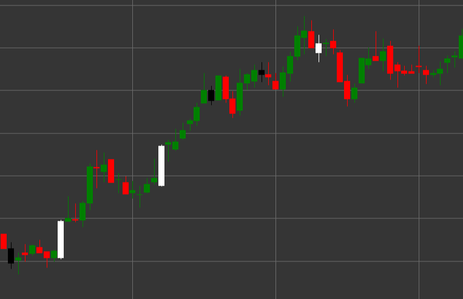

# Spinning Top パターン

Spinning Top は、小さなローソク足の実体と、ほぼ同じ長さの長い上ヒゲおよび下ヒゲを特徴とするローソク足パターンです。このパターンは、市場の迷いと、買い手と売り手の攻防を示します。

##### 主な特徴:

- 小さなローソク足の実体 (白/緑または黒/赤のどちらでも可)。
- ほぼ同じ長さの長い上ヒゲと下ヒゲ。
- 強気派と弱気派の均衡を示す。
- 市場の迷いと潜在的なトレンド変化を反映する。

### 解釈

Spinning Top は、市場の迷いを示します。

- 長いヒゲは、その期間中に価格が上下の両方向へ大きく変動したことを示します。
- 小さな実体は、高いボラティリティにもかかわらず、終値が始値から大きく離れなかったことを意味します。
- 上昇トレンド内では、強気モメンタムの弱まりを示す場合があります。
- 下降トレンド内では、弱気圧力の消耗を示す場合があります。
- トレンドの天井、または重要なレジスタンス水準の手前では、反転を予兆する場合があります。

### 取引戦略

Spinning Top そのものは強い取引シグナルではありませんが、他の要因と組み合わせて使用できます。

- 取引判断を行う前に、後続のローソク足から追加の確認を探します。
- Morning Star や Evening Star など、より複雑なローソク足パターンの一部として使用します。
- 重要なサポート水準またはレジスタンス水準で Spinning Top が形成された後は、その後の価格変動に対する注意を高めます。
- 長期トレンドの後に Spinning Top が現れた場合は、ストップロスを引き締めることができます。

## 関連項目

[Hammer パターン](hammer.md)

[Inverted Hammer パターン](inverted_hammer.md)
