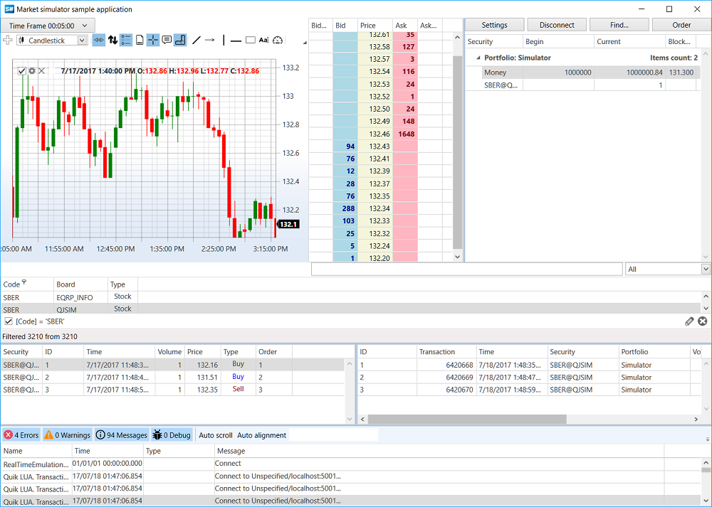

# リアルタイム市場データテスト

リアルタイム市場データテストでは、取引所への実際の接続 (「ライブ」気配値) を使用して取引しますが、取引所に実際の注文は発注しません。登録されたすべての注文は捕捉され、その執行は市場の板情報に基づいてエミュレートされます。このようなテストは、たとえば取引シミュレーターを開発する場合や、実際の気配値を使って短期間で取引アルゴリズムを確認する場合に有用です。

実データで取引をエミュレートするには、[RealTimeEmulationTrader\<TAdapter\>](xref:StockSharp.Algo.Testing.RealTimeEmulationTrader`1) を使用する必要があります。これは、特定の取引システムコネクター ([Binance](../connectors/crypto_exchanges/binance.md)、[Interactive Brokers](../connectors/stock_market/interactive_brokers.md) など) の「ラッパー」として動作します。

## エミュレーションコネクターの作成

エミュレーションコネクターを作成するには、まず市場データを受信する通常のコネクターを作成し、その後それを基にエミュレーションコネクターを作成します。

```csharp
// 市場データを受信する通常のコネクタを作成
private readonly Connector _realConnector = new();

// エミュレーション用コネクタを作成
_emuConnector = new RealTimeEmulationTrader<IMessageAdapter>(_realConnector.Adapter, _realConnector, _emuPf, false);

// エミュレーションパラメータを設定
var settings = _emuConnector.EmulationAdapter.Emulator.Settings;
settings.TimeZone = TimeHelper.Est;
settings.ConvertTime = true;
```

取引エミュレーションには、特別なポートフォリオを使用する必要があります。

```csharp
private readonly Portfolio _emuPf = Portfolio.CreateSimulator();
```

## イベントの購読

通常のコネクターと同様に、エミュレーションコネクターは市場データの受信時およびトランザクションの実行時にイベントを生成します。

```csharp
// コネクタイベントを購読
_emuConnector.Connected += () =>
{
	// GUI ラベルを更新
	this.GuiAsync(() => { ChangeConnectStatus(true); });
};

_emuConnector.Disconnected += () =>
{
	// GUI ラベルを更新
	this.GuiAsync(() => { ChangeConnectStatus(false); });
};

_emuConnector.ConnectionError += error => this.GuiAsync(() =>
{
	// GUI ラベルを更新
	ChangeConnectStatus(false);
	MessageBox.Show(this, error.ToString(), LocalizedStrings.ErrorConnection);
});

_emuConnector.OrderBookReceived += OnDepth;
_emuConnector.PositionReceived += (sub, p) => PortfolioGrid.Positions.TryAdd(p);
_emuConnector.OwnTradeReceived += (s, t) => TradeGrid.Trades.TryAdd(t);
_emuConnector.OrderReceived += (s, o) =>
{
	if (!_fistTimeOrders.Add(o))
		return;

	_bufferOrders.Add(o);
	OrderGrid.Orders.Add(o);
};

// 注文登録エラーを購読
_emuConnector.OrderRegisterFailReceived += (s, f) => OrderGrid.AddRegistrationFail(f);

_emuConnector.CandleReceived += (s, candle) =>
{
	if (s == _candlesSubscription)
		_buffer.Add(candle);
};
```

## 市場データの購読

市場データを扱うには、適切なデータ型を購読する必要があります。

```csharp
// エミュレーション用コネクタで板情報、ティック、Level1 を購読
_emuConnector.Subscribe(new(DataType.MarketDepth, security));
_emuConnector.Subscribe(new(DataType.Ticks, security));
_emuConnector.Subscribe(new(DataType.Level1, security));

// 実コネクタの板情報をサブスクライブする（エミュレーションに必要）
_realConnector.Subscribe(new(DataType.MarketDepth, security));

// ローソクを購読
_candlesSubscription = new(CandleDataTypeEdit.DataType, security)
{
	From = DateTimeOffset.UtcNow - TimeSpan.FromDays(10),
};
_emuConnector.Subscribe(_candlesSubscription);
```

## 注文登録と管理

注文は、通常のコネクターと同様にエミュレーションコネクターを通じて登録されます。

```csharp
// 注文登録
_emuConnector.RegisterOrder(order);

// 注文取消
_emuConnector.CancelOrder(order);

// 注文変更
_emuConnector.ReRegisterOrder(order, newPrice, order.Balance);
```

## エミュレーションパラメーターの設定

[MarketEmulatorSettings](xref:StockSharp.Algo.Testing.MarketEmulatorSettings) プロパティを使用して、エミュレーションパラメーターを設定できます。

```csharp
var settings = _emuConnector.EmulationAdapter.Emulator.Settings;

// タイムゾーンを設定
settings.TimeZone = TimeHelper.Est;

// 時刻を変換
settings.ConvertTime = true;

// 価格到達時に注文をマッチング
settings.MatchOnTouch = false;

// 注文実行レイテンシをエミュレート
settings.Latency = TimeSpan.FromMilliseconds(100);
```

## インターフェイス例

SampleRealTimeEmulation の例は、実コネクターとエミュレーションコネクターの両方からのデータを同時に表示できることを示しています。



アプリケーションインターフェイスには、次の要素が含まれます。
- ローソク足と注文を表示するチャート
- 注文および自己約定テーブル
- 実市場とエミュレーションの板情報
- 注文の作成およびキャンセル用コントロール

## 利点と制限

リアルタイム市場データテストには、次の利点があります。
- 金銭的リスクなしで実市場データを使用
- 実際の取引に非常に近い条件でアルゴリズムをテスト
- リアルタイムで実市場と結果を比較可能

制限:
- テスト速度は実データのレートに制限されます
- 履歴期間でテストできません
- 受信した市場データの品質と完全性に依存します
